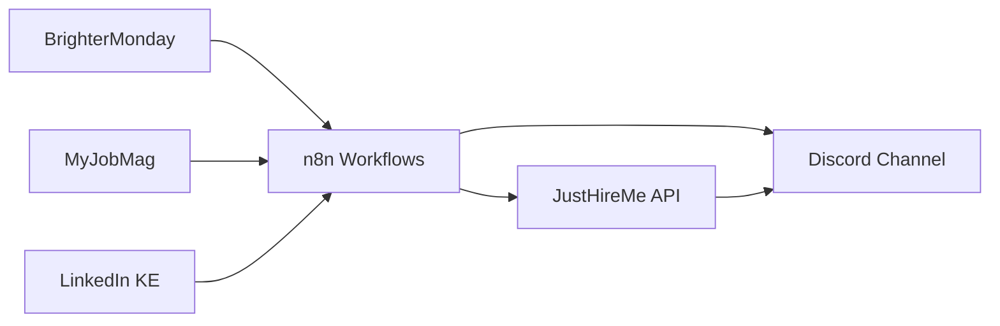

---
tags:
  - moc
  - project
  - job-search
  - n8n
  - kenya
aliases:
  - "Job Search Infrastructure"
  - "n8n + JustHireMe"
created: 2026-05-21
status: planning
---

# Job Search Infrastructure — Map of Content

> [!summary] Architecture for automated job feed collection using n8n, feeding into JustHireMe for AI-powered ranking and tailoring.
>
> **Goal:** Passive monitoring of KE job sites → filter → rank → notify
> **Stack:** n8n (scraper) + JustHireMe (AI engine) + Discord (output)

## Architecture

## Research

- [[n8n Setup & Configuration]]
- [[Kenyan Job Sites — Feeds & Scraping]]
- [[n8n + Discord Integration]]

## Components

### n8n (Data Collection)
- Self-hosted workflow engine
- Schedule triggers (daily/hourly)
- HTTP request nodes for scraping
- Webhook output to JustHireMe

### JustHireMe (AI Ranking)
- Existing Python/FastAPI backend
- Job description → resume matching
- Tailored application generation
- See: [[JustHireMe — Current State]]

### Discord (Output)
- Job alerts channel
- Filtered by relevance score
- Click-through to apply

## Decisions Log

- **2026-05-21:** Decided to use n8n as scraping layer, not rewrite scraping in JustHireMe
- **2026-05-21:** n8n first (get feeds flowing), JustHireMe integration second

## Progress

- [ ] Research n8n self-hosting on Arch
- [ ] Map KE job site structures (BrighterMonday, MyJobMag)
- [ ] Design n8n workflow schemas
- [ ] Set up Discord webhook for output
- [ ] Connect to JustHireMe API
