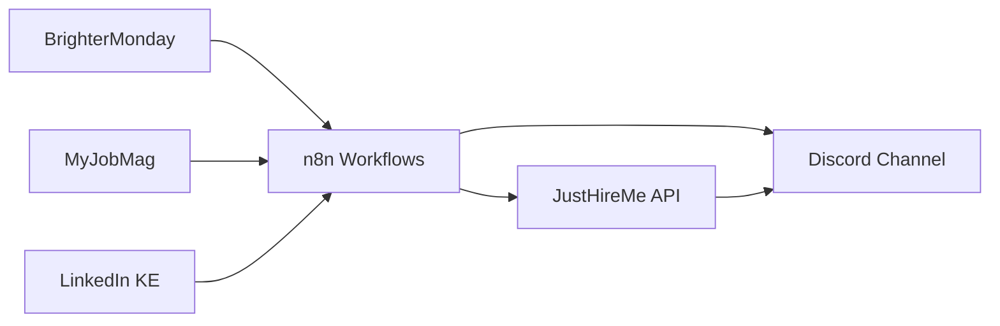

---
tags:
  - moc
  - project
  - job-search
  - n8n
  - automation
  - kenya
aliases:
  - "Job Search Infrastructure"
  - "n8n + JustHireMe"
created: 2026-05-21
status: planning
---

# Job Search Infrastructure — Map of Content

> **Automated job feed collection → AI ranking → Discord alerts.**
> Stack: n8n (scraper) · JustHireMe (AI) · Discord (output)

## Components

| Layer | Tool | Notes |
|---|---|---|
| Scraping | [[n8n Setup & Configuration]] | RSS + HTTP + Playwright |
| Sites | [[Kenyan Job Sites — Feeds & Scraping]] | 8 sites mapped by difficulty |
| Output | [[n8n + Discord Integration]] | Rich embeds by relevance score |
| AI | JustHireMe | Matching + tailoring (TBD) |

## Decisions

- **2026-05-21:** n8n as scraping layer, not rewriting scraping in JustHireMe
- **2026-05-21:** n8n first (feeds), JustHireMe second

## Progress

- [ ] Research n8n self-hosting on Arch
- [ ] Map KE job site structures
- [ ] Design n8n workflow schemas
- [ ] Set up Discord webhook
- [ ] Connect to JustHireMe API
