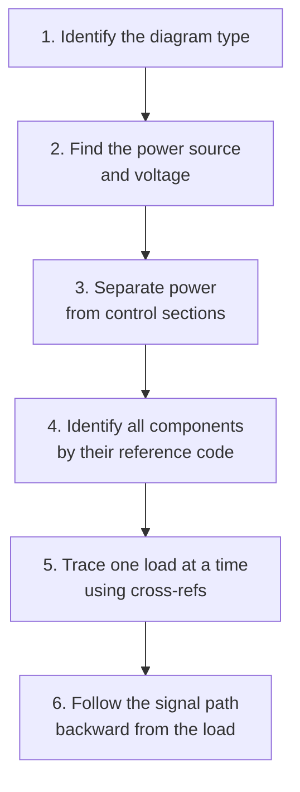
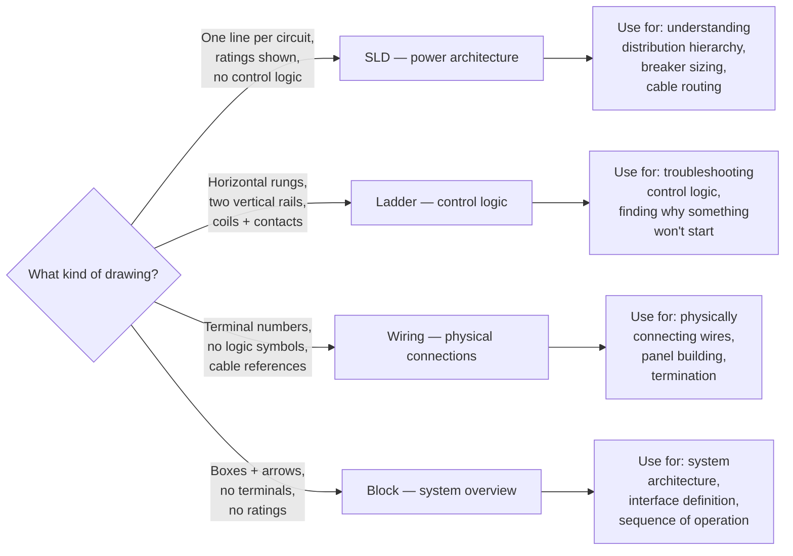
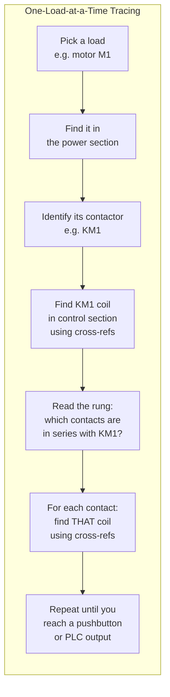

# Schematic Decode Method — The Cheatsheet

## Thinking Pattern

> **Schematics are a language with a grammar. Identify the diagram type (noun), separate power from control (verb), trace using cross-refs (preposition), and decode labels (article).** The method is always the same — only the application changes.

## The 6-Step Decode Method



### Step 1: Identify the Diagram Type



**If you only have one diagram**: It's probably a ladder diagram. The power section may be on the same page (simple drawing) or cross-referenced to another page (complex).

### Step 2: Find the Power Source

| Question | Where to look |
|----------|--------------|
| What voltage feeds the control circuit? | Control transformer primary/secondary ratings, or power supply label |
| Is it AC or DC? | Control transformer → AC. DC power supply → DC. The symbol and labels tell you |
| What's the voltage at the load? | Motor nameplate on SLD, or motor symbol on ladder (usually 400/230/480V) |
| Where does the power come from? | Top of SLD (utility feed), or top-left of ladder diagram (mains L1, L2, L3) |

### Step 3: Separate Power from Control

| | Power Circuit | Control Circuit |
|--|--------------|----------------|
| **What's there** | Disconnects, fuses, contactor main poles, OL heaters, motors, heaters | Pushbuttons, coils, relays, PLC I/O, pilot lights, solenoids, timers |
| **Voltage** | Mains voltage (230/400/480/690V) | Lower voltage (24VDC, 120VAC) |
| **Current** | Load current (amps to kiloamps) | Signal/coil current (milliamps to a few amps) |
| **Where on page** | Top (often on page 1 or 0) | Below power section or on separate pages |

**On a simple drawing**: The power section is the top part, control section is the bottom part. A dashed line or horizontal divider separates them. The control transformer sits right at the boundary — its primary comes from the power section, its secondary feeds the control section.

**On a complex drawing**: The power and control sections may be on completely separate sheets. The cross-references on the contactor coil tell you where the main contacts are (in the power section, on sheet 3) and where the auxiliary contacts are (in the control section, on sheets 4-6).

### Step 4: Identify All Components by Reference Code

Refer to [[sc-symbols-labels]] for the full table, but here's the shortcut:

```
Letter → what it DOES:
  F  = protective device (fuse, MCB, OL relay)
  K  = relay, contactor (coil symbol)
  KM = contactor (main switching)
  KA = auxiliary relay
  KT = timer relay
  Q  = breaker, disconnect switch
  M  = motor
  S  = pushbutton, limit switch, selector
  T  = transformer
  X  = terminal block
  Y  = solenoid, actuator
```

**On the physical panel**, component labels match the schematic. If the schematic says "K1", the relay labelled "K1" on the panel is that exact device. The terminal block labelled "X1:12" on the schematic means terminal block X1, pin 12 in the panel.

### Step 5: Trace One Load at a Time

**The rule: pick ONE load (motor, heater, solenoid, lamp) and trace only that.**



Each step answers: "What must be true for this component to energise?"

```
Example — Motor M1 won't start:
  Load M1 → needs KM1 main contacts closed
  KM1 coil → on rung 5, cross-ref says "NO: 5"
  Rung 5: +24V ──[K1 NO]──[S2 NC]──[S3 NO]──[KM1 coil]── 0V
    KM1 needs: K1 energised AND S2 NOT pressed AND S3 pressed
  K1 coil → on rung 2, cross-ref says "NO: 5" (same rung found)
  Rung 2: +24V ──[S1 NC]──[S4 NO]──[K1 coil]── 0V
    K1 needs: S1 NOT pressed AND S4 pressed
  → If S4 isn't pressed, that's why M1 won't start
```

### Step 6: Follow the Signal Path Backward

This is the same as Step 5 but expressed as a mantra:

> **Start at the load. Work backward through each series element. Each coil leads to another rung. Each rung leads to another coil or a switch. Eventually you reach an operator action (pushbutton) or an automation command (PLC output).**

## Quick Reference: What Each Symbol Area Looks Like

### SLD Reading Order

```
Top:        Utility / incoming supply
            │
            ├── Breaker (main)
            │   │
            ├── Transformer (if any)
            │   │
            ├── Main distribution bus
            │   ├── Feeder breaker 1 ── cable ── load 1
            │   ├── Feeder breaker 2 ── cable ── load 2
            │   └── Feeder breaker 3 ── cable ── load 3
            │
Bottom:     Loads (motors, panels, transformers)

Read: Top-to-bottom. Each branch is one circuit.
```

### Ladder Reading Order

```
Left rail ──┬── rung 1 ──────────────────┬── Right rail
            │                            │
            ├── rung 2 ─── contacts ─────┤
            │                            │
            ├── rung 3 ─── coil ─────────┤
            │                            │
            ├── rung 4 ──────────────────┤
            │                            │
            └── rung 5 ──────────────────┘

Read: Top-to-bottom (sequence), left-to-right per rung (logic).
```

### Power Section vs Control Section Layout

```
┌──────────────────────────────────────────────────┐
│  POWER SECTION                                    │
│  L1 ───[Q1]───[F1]───[KM1]───[OL]─── M1         │
│  L2 ───[Q1]───[F1]───[KM1]───[OL]─── M1         │
│  L3 ───[Q1]───[F1]───[KM1]───[OL]─── M1         │
│                                                   │
│  ───[T1]─── control transformer                    │
├──────────────────────────────────────────────────┤
│  CONTROL SECTION                                  │
│  +24V ───────────────┬────────────── 0V           │
│  [S1 E-stop]──[S2]───┤                           │
│  [K1/k]──────[S3]───[K2 coil]                    │
│  [K2/k]─────────────[KM1 coil] (→ page 3)        │
└──────────────────────────────────────────────────┘
```

## Circuit States — What "Normal" Means

| Component state | On a schematic | In real life (powered) |
|----------------|---------------|----------------------|
| Relay/contactor coil NOT energised | NO contact = open, NC = closed | Same — that's the "normal" drawn state |
| Relay/contactor coil energised | NO contact = closed, NC = open | Depends on the coil — check cross-refs |
| Pushbutton NOT pressed | Drawn as rest state (NO = open, NC = closed) | Same |
| Limit switch NOT actuated | Drawn as rest state | Same |
| MCB not tripped | Closed (line passes through) | Same |
| OL relay not tripped | NC contact is closed | Same |
| E-stop NOT pressed | NC contact is closed | Same |

**The trap reversed**: "The motor won't start. The schematic shows KM1 contact is open — that means something is wrong." No — the schematic shows everything OFF. KM1's contact is drawn open because the diagram shows the state of the circuit when the machine is not running. The question is: when you press START, does everything line up to close that contact?

## Common Mistakes

| Mistake | Why it's wrong |
|---------|---------------|
| Reading the power section like a ladder | The power section is NOT a series of logic rungs. It's a parallel distribution. Each phase line runs top-to-bottom with series elements, but there's no logic — just protection + switching |
| Ignoring wire numbers | Wire numbers connect pages. Wire "105" on page 3 is the same physical circuit as wire "105" on page 5. If you don't follow wire numbers across pages, you're missing half the circuit |
| Confusing terminal numbers with wire numbers | Terminal numbers are on the component (e.g., `A1`, `A2`, `13`, `14`). Wire numbers are on the line connecting them. They're different numbering systems |
| Forgetting that series = AND, parallel = OR | In the control circuit: contacts in series must ALL be true. Contacts in parallel: ANY being true is enough |
| Assuming the "normal" state means normal operation | "Normal" on a schematic means "no power, no actuation". A fan running normally with its limit switch actuated means the drawing shows the switch in the opposite state from reality |

## Cross-References

- [[sc-diagram-types]] — identify the diagram first
- [[sc-symbols-labels]] — decode the reference codes
- [[sc-reading-ladder]] — deep dive on ladder tracing
- [[sc-relays]] — relay coil/contact behaviour
- [[sc-contactors]] — contactor main + aux contact behaviour
- [[sc-iec-nema]] — symbol differences between standards
