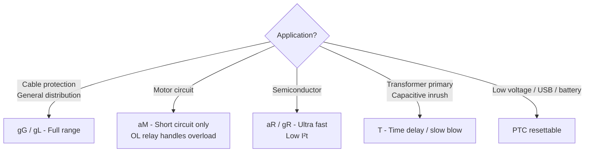
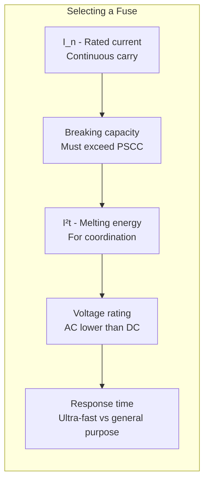
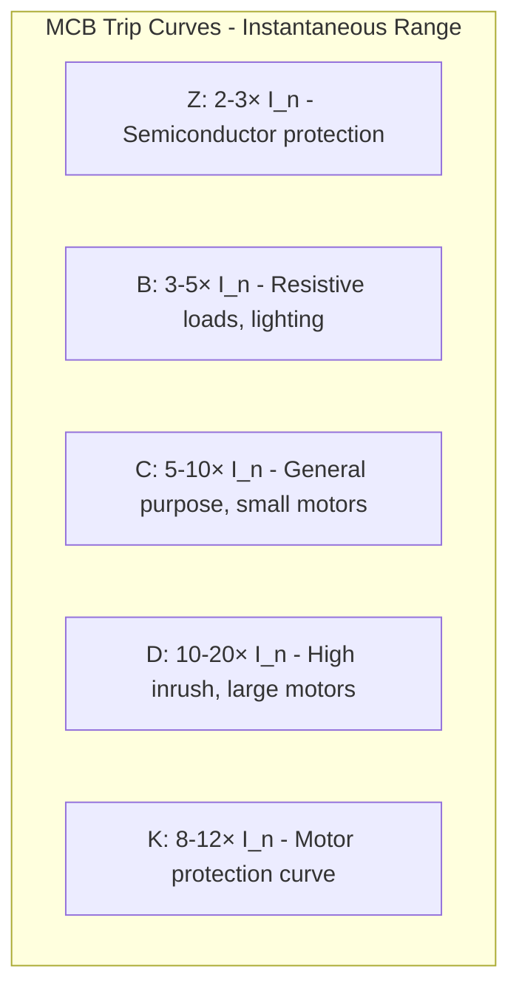
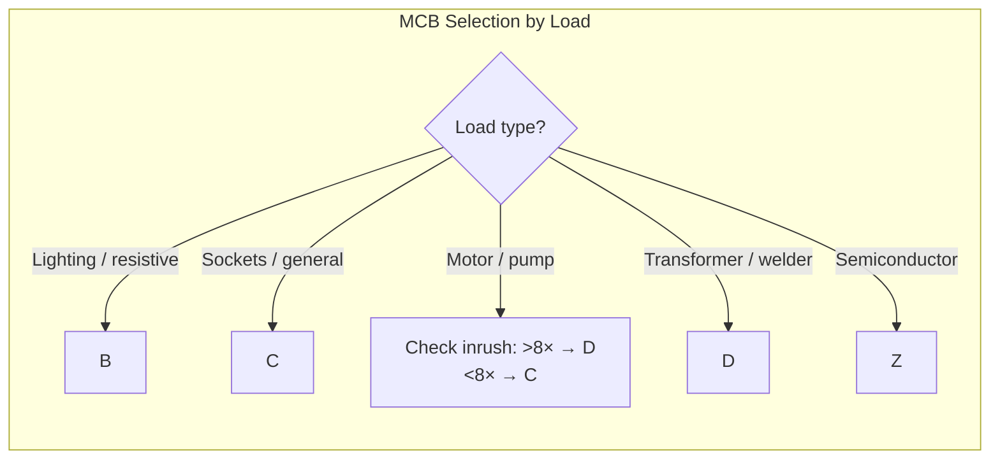
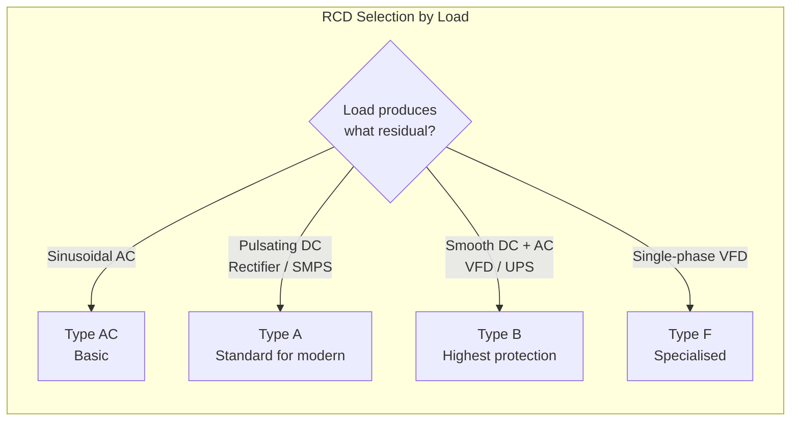

# Circuit Breakers & Fuses

## Thinking Pattern

> **Protection devices are either one-time (fuse) or resettable (breaker).** Both work by heat: a fuse melts an element, a breaker bends a bimetal strip or triggers an electronic trip. They protect *the wiring*, not the load — the load is protected by the overload relay or thermostat.

```
  Source ----[Fuse/MCB]----[Contactor]----[OL Relay]----[Motor]
                  |               |             |
              Short circuit      ON/OFF      Overload
              protection                     protection
```

The fuse/MCB is sized for the *cable* ampacity, not the motor current. The OL relay is sized for the motor's full-load current.

## Fuses



| Type | Full name | Breaks | Application |
|------|-----------|--------|-------------|
| **gG** | General purpose full range | Overload + short circuit | Cable protection, distribution boards |
| **gL** | Same as gG (DIN) | Overload + short circuit | Same — regional naming difference |
| **aM** | Motor circuit partial range | Short circuit ONLY | Motor feeders (OL relay handles overload) |
| **aR** | Semiconductor partial range | Short circuit ONLY | Diode/SCR/IGBT protection |
| **gR** | Semiconductor full range | Overload + short circuit | Sensitive circuits needing both |
| **T** | Time delay / slow-blow | Overload + short circuit | Transformer primary, capacitor banks |
| **PTC** | Resettable (polymer PTC) | Overcurrent (latches high-R) | USB, battery, low-voltage DC |

### Key Parameters



- **Breaking capacity**: The maximum fault current the fuse can safely interrupt. If your prospective short-circuit current (PSCC) is 50 kA and the fuse is rated 25 kA, the fuse can explode.
- **I²t**: The energy let-through. Critical for coordination — downstream fuse must have lower I²t than upstream fuse.
- **Minimum fusing current**: Typically 1.3-1.5× I_n. Below this, the fuse may *never* blow. Fuses are NOT precise overload protection.

**Trap**: A fuse's DC voltage rating is much lower than its AC rating. A 250 VAC fuse might only be rated 32-65 VDC. DC arcs don't self-extinguish — the fuse must be able to quench the arc without a zero-crossing.

## MCB (Miniature Circuit Breaker)

MCBs have two trip elements in series:
- **Thermal** (bimetal strip): Responds to sustained overload. Slow, inverse-time characteristic.
- **Magnetic** (solenoid): Responds to short-circuit current. Instantaneous (within half-cycle).

### Trip Curves



| Curve | Instantaneous trip | Inrush tolerance | Typical loads |
|-------|-------------------|------------------|---------------|
| **Z** | 2-3× I_n | Very low | Semiconductors, sensitive electronics |
| **B** | 3-5× I_n | Low | Lighting, heaters, cable protection |
| **C** | 5-10× I_n | Medium | Plugs, sockets, small motors, general distribution |
| **D** | 10-20× I_n | High | Large motors, transformers, welding, cranes, elevators |
| **K** | 8-12× I_n | Medium-high | Motor circuits (better thermal match than D) |

**The curve only affects the magnetic (short-circuit) trip point.** The thermal overload characteristic is identical across curves for the same I_n — a B16 and C16 both trip at 1.13-1.45× I_n in the thermal region.



### Breaking Capacity

The MCB must have a breaking capacity (I_cu) equal to or greater than the PSCC at its installation point:

| Location | Typical PSCC | Required I_cu |
|----------|-------------|---------------|
| Domestic subcircuit | <3 kA | 6 kA |
| Domestic main board | 3-10 kA | 10 kA |
| Industrial distribution | 10-50 kA | 25-65 kA |

**Trap**: MCBs are rated for AC unless explicitly marked for DC. A standard AC MCB will NOT clear a DC fault reliably — the DC arc sustains. DC-rated MCBs have blowout magnets to stretch the arc into the chute.

## MCCB (Moulded Case Circuit Breaker)

| Feature | Thermal-magnetic MCB | Electronic MCCB |
|---------|---------------------|-----------------|
| Rated current | Up to 125 A | Up to 1600+ A |
| Overload setting | Fixed (1.13-1.45× I_n) | Adjustable I_r (0.4-1.0× In) |
| Short circuit setting | Fixed by curve (B/C/D) | Adjustable I_i (1.5-12× I_r) |
| Time delay (short circuit) | None (instantaneous) | Adjustable (up to 0.5 s) |
| Ground fault | No | Yes — optional GF module |
| Communication | No | Optional Modbus, Profibus, Ethernet |

### LSIG (Electronic Trip Unit Settings)

```
L - Long time (overload):     I_r setting + time band (t_r)
S - Short time (short circuit): I_sd setting + time delay (t_sd)
I - Instantaneous:              I_i setting (no intentional delay)
G - Ground fault:               I_g setting + time delay (t_g)
```

**Selectivity (discrimination)**: Two series breakers are selective if the downstream breaker clears the fault before the upstream breaker for ALL fault currents up to the selectivity limit. Achieved by coordinating trip curves. Full selectivity is expensive — cascading breakers (where the upstream provides backup if downstream fails) is common.

## ACB (Air Circuit Breaker)

For main incomers in LV switchboards (630-6300 A). Features:
- **Drawout**: Breaker racks out for maintenance without disconnecting power cables
- **Full LSIG programmability**
- **Zone-selective interlocking**: Breakers communicate fault location to coordinate — the breaker nearest the fault trips immediately; upstream breakers hold.

## RCD / RCBO

| Device | Function | Notes |
|--------|----------|-------|
| **RCD** (RCCB) | Earth leakage detection | No overcurrent protection alone |
| **RCBO** | MCB + RCD combined | Overcurrent + earth leakage in one module |

### RCD Types



| Type | Detects | Required for |
|------|---------|--------------|
| AC | Sinusoidal AC residuals | Resistive loads only — minimum acceptable |
| A | AC + pulsating DC | Rectifiers, SMPS, VFDs (most modern equipment) |
| B | AC + pulsating DC + smooth DC + HF | VFDs, UPS, EV chargers |
| F | AC + pulsating DC (extended frequency) | Single-phase VFDs |

**Trap**: Many modern devices (washing machines, LED drivers, EV chargers) produce DC leakage current that blinds a Type AC RCD. Type A or B is increasingly mandatory in new installations.

## Cross-References

- [[sc-contactors]] — motor starter coordination with upstream breaker
- [[pe-m9-power-supply-design]] — input fuse, inrush limiting, protection in power supply design
- [[pe-m11-thermal-emc-layout]] — breaker selection for panel design, coordination
