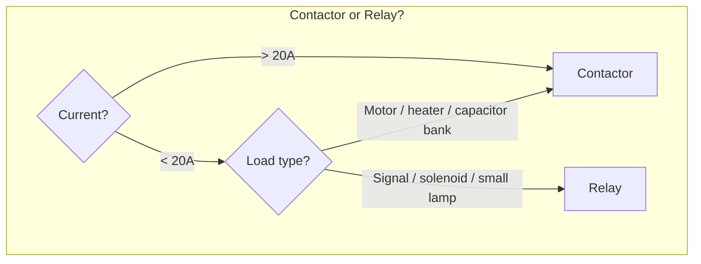
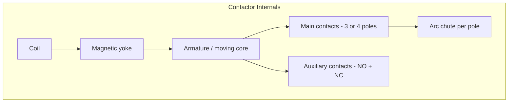
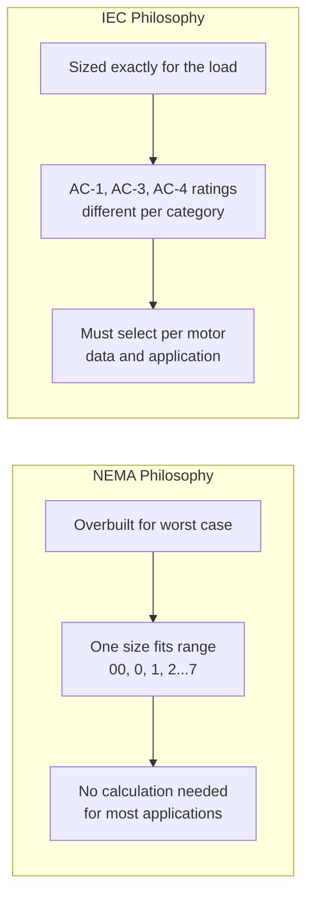
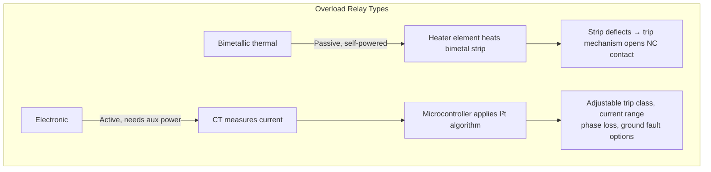
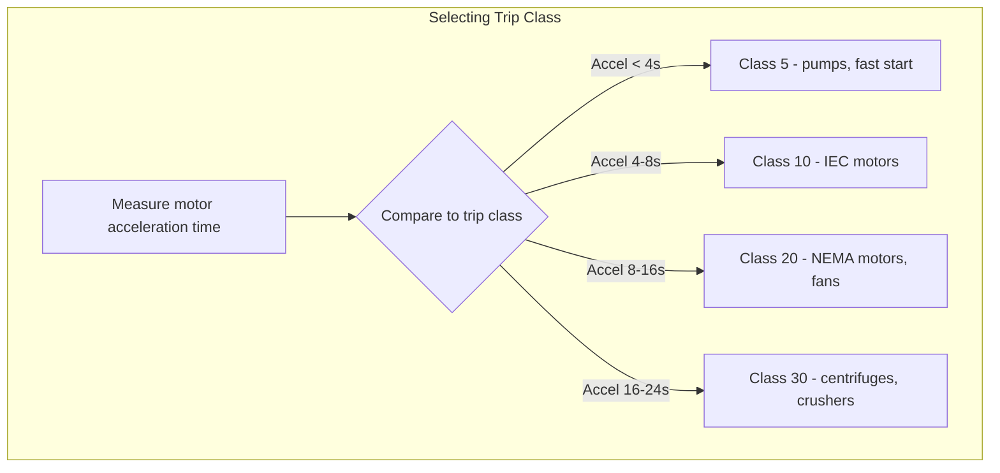
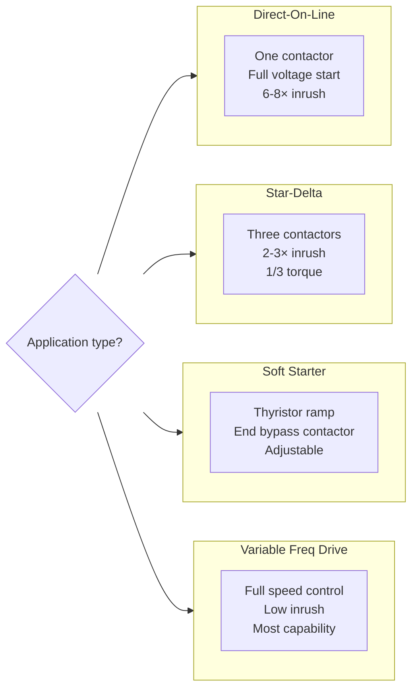

# Contactors & Motor Starters

## Thinking Pattern

> **A contactor is a relay built for high current.** The core difference: a contactor manages the arc (arc chutes, blowout magnets) and is designed to make/break *power* repeatedly. A relay is designed to switch *signals*.

> **A motor starter is a contactor + an overload relay.** The contactor handles the ON/OFF; the overload relay protects the motor from overheating.

```
Control circuit (24V)                Power circuit (400V)
     |                                     |
  [Start button]                      [Contactor main poles]
       |                                     |
  [Contactor coil] ----+                     |
       |               |                     |
  [Stop button] ---[OL relay NC]         [Motor]
```

The overload relay's NC contact is in *series* with the contactor coil. If the motor overheats, the OL relay opens, the coil de-energises, and the main contacts open — motor stops.

## Relay vs Contactor



| Feature | Relay | Contactor |
|---------|-------|-----------|
| Arc management | Small gap, some magnetic blow | Arc chute (stack of steel plates), blowout coils |
| Contact material | AgNi, AgSnO₂ | AgW, AgCdO — erosion-resistant |
| Auxiliary contacts | Part of contact form (Form C) | Separate bolt-on auxiliary block |
| Standard | IEC 61810 | IEC 60947-4-1 |
| Coil types | AC and DC | AC (with shading ring) or DC |
| Typical current | 1-15 A | 9-2000+ A |

## Construction



Each main pole has its own arc chamber with a stack of splitter plates. When the contacts open, the arc rises (thermal) into the splitter stack, where it's stretched, cooled, and extinguished — typically within half a cycle.

### The Shading Ring

AC contactors have a copper shorted ring embedded in the pole face of the magnetic yoke. This ring creates a phase-shifted secondary magnetic flux that keeps the armature pulled in during the zero-crossings of the AC waveform (when the main flux drops to zero).

**Failure mode**: If the contactor sees persistently low voltage (~80% or below), the armature chatters. The shading ring overheats, cracks, and eventually breaks. The contactor still "clicks" but now buzzes loudly at 50/60 Hz — and will fail to stay closed under load within days or weeks.

## IEC & NEMA Ratings



| Utilisation Category | Load type | Application |
|----------------------|-----------|-------------|
| AC-1 | Resistive | Heating, lighting — no inrush |
| AC-3 | Squirrel-cage motor | Starting + running disconnect. 6× inrush, 0.15 pf |
| AC-4 | Motor reversing / plugging | Most severe. Contacts make AND break at locked-rotor current |
| DC-1 | DC resistive | |
| DC-3 | DC motor | Starting + plugging |

**Critical trap**: An AC-3 rated contactor at 100 A might only be rated 45 A for AC-4. If the application involves jogging, inching, or plugging (AC-4), the contactor must be derated significantly. Running AC-3 duty in an AC-4 application destroys the contacts within weeks.

## Thermal Overload Relay



| Feature | Bimetallic | Electronic |
|---------|------------|------------|
| Power source | Self-powered (load current heats element) | Needs control power (24 VDC typically) |
| Accuracy | ±10-20% | ±2-5% |
| Temperature compensation | Manual or none | Automatic (built-in sensor) |
| Adjustability | Fixed current range ± setting dial | Wide range via DIP or software |
| Phase loss detection | Some (unbalanced current heats differently) | Yes |
| Communications | No | Optional (Modbus, Profibus) |

**Trap**: A non-compensated bimetallic relay installed in a hot panel (50°C ambient) trips at a lower current than its dial setting — possibly nuisance-tripping a motor that isn't overloaded. The motor would run fine in cooler conditions.

## Trip Classes



**Rule**: Acceleration time must be < 80% of the trip class time at 6× FLA.

Example: A motor takes 10 seconds to reach full speed. Class 20 gives 20 × 0.8 = 16 seconds margin → OK. Class 10 gives 10 × 0.8 = 8 seconds → the OL relay will trip during starting.

| Class | Trip time at 6× I_set | Used for |
|-------|----------------------|----------|
| 5 | <5 s | Submersible pumps, fast-start |
| 10 | <10 s | IEC motors (standard) |
| 10A | <10 s (narrow band) | Semiconductor protection |
| 20 | <20 s | NEMA motors (standard) |
| 30 | <30 s | High inertia |

## Motor Starter Configurations



| Configuration | Starting current | Starting torque | Cost | Complexity | Best for |
|---------------|-----------------|-----------------|------|------------|----------|
| DOL | 6-8× FLA | Full | Low | Low | Small motors, simple |
| Star-Delta | 2-3× FLA | 1/3 full | Low-Med | Medium | Pumps, fans (low start torque) |
| Soft starter | 2-5× FLA | Adjustable | Medium | Medium | Pumps (water hammer), conveyors |
| VFD | 1-1.5× FLA | Full at low freq | High | High | Variable speed, process control |

## Cross-References

- [[sc-relays]] — relay vs contactor comparison
- [[sc-circuit-protection]] — fuses and breakers upstream of motor starters, coordination
- [[pe-m10-motor-drives]] — VFD topologies, DC bus, braking choppers
