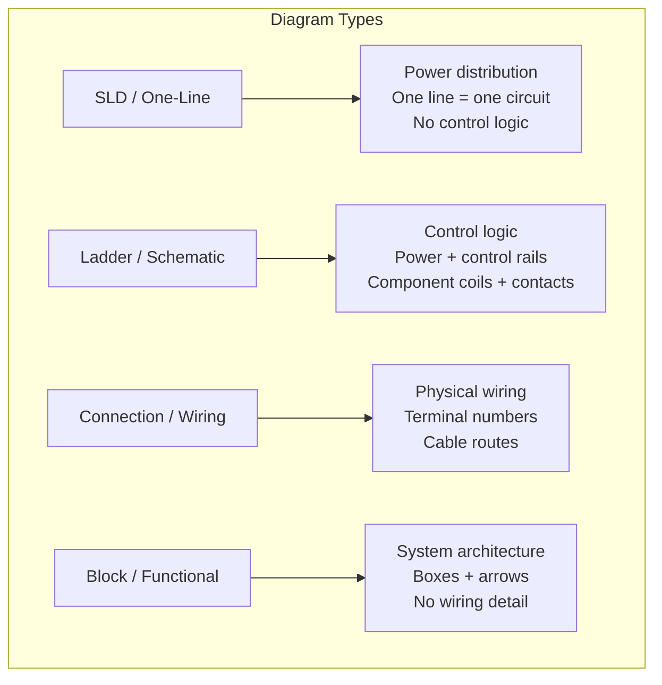
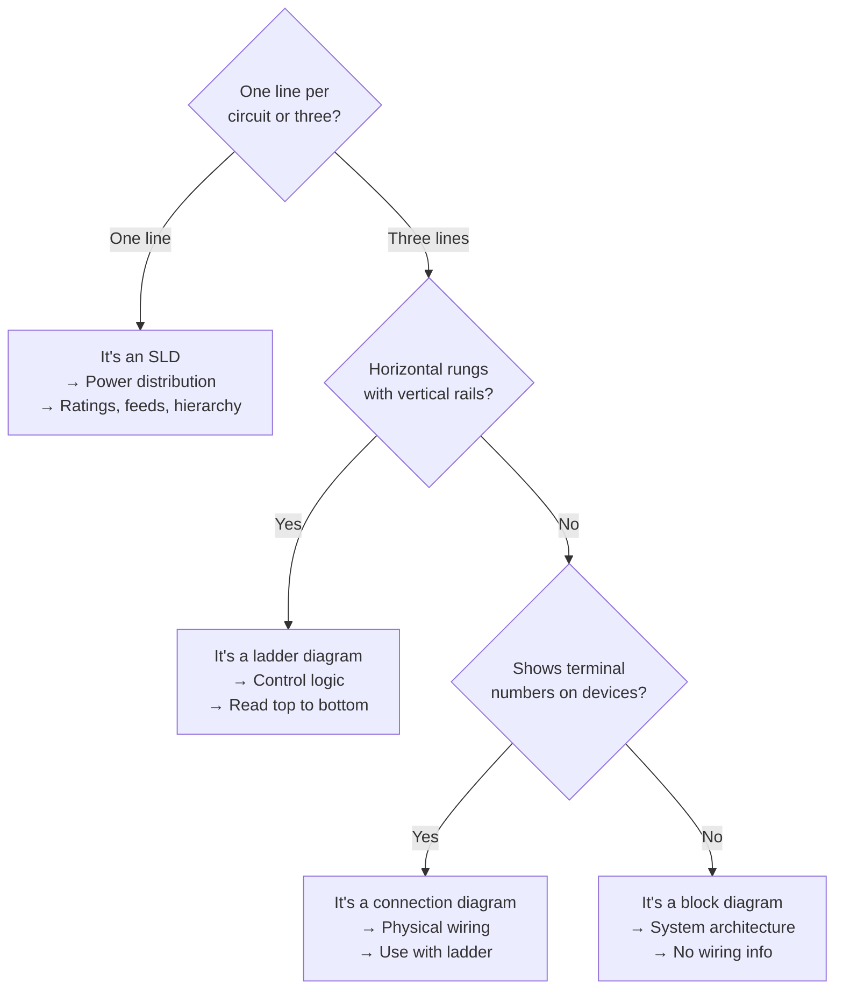

# Diagram Types — What You'll Actually See

## Thinking Pattern

> **A diagram type is defined by what it's meant to communicate.** A single-line diagram tells you how power flows through the building. A ladder diagram tells you how the control logic works. A wiring diagram tells you where to land every wire. Never read one expecting the other's job.

```
            FUNCTIONAL DETAIL
               high
  SLD ───────────┬────────────────────────────────── block diagram
                 │                                        │
                 │                                        │
                 │                                        │
                 │                                        │
  PHYSICAL    low ─────────────┬────────────────────── high    LOGICAL
  (real wires)                  │                              (abstract)
                               │
                               │
                         ladder diagram
                         connection diagram
                         terminal diagram
                            │
                         low
                      (real + detailed)
```

## The Four You'll Actually Encounter



### Single-Line Diagram (SLD)

An SLD represents a 3-phase system with a single line per circuit. Used for power distribution — switchboards, substations, generators, feeders. **No control logic whatsoever.**

```
Utility 11kV
    │
   [VCB]   ── vacuum circuit breaker
    │
  [TR1]    ── 500 kVA, 11/0.415 kV
    │
   [ACB]   ── main breaker, 630 A
    │
    ├──── [MCCB-1] ── [CT] ── [M1]  45 kW pump
    ├──── [MCCB-2] ── [CT] ── [M2]  30 kW fan
    ├──── [MCB]    ── [DB-A]         lighting panel
    └──── [MCB]    ── [DB-B]         socket panel
```

**What the symbols tell you**:
- Each switch/breaker symbol is one device (even though it's 3-pole)
- Ratings are written beside each symbol (current, breaking capacity)
- The feed direction is top-to-bottom (utility at top, loads at bottom)
- Transformers show winding configuration (Dyn11, YNd1), kVA rating, voltage ratio
- CTs are shown as a circle with the conductor passing through — ratio noted
- Cable sizes and types are written beside the line

**When you see one**: You're looking at the power architecture. Use it to understand the hierarchy of distribution — which breaker feeds which panel, how many loads, what size. Do NOT look for pushbuttons, relays, or PLC logic here.

**Trap**: An SLD uses single-line representation, but in reality each circuit has 3 phases + neutral + earth. The SLD hides this for clarity. Never assume neutral conductor or earth conductor sizing from the SLD alone — refer to the cable schedule.

### Ladder Diagram (Schematic)

The most common industrial control drawing. Two vertical rails (power supply), horizontal rungs (circuits). The format is designed for sequential logic — top rungs execute first, current flows left-to-right through each rung.

```mermaid
graph TD
    subgraph LadderLayout["Ladder Diagram Layout"]
        L1["+24V rail"]
        N["0V rail"]

        R1["---[S1]---[K1 coil]---"]
        R2["---[K1 contact]---[K2 coil]---"]
        R3["---[K2 contact]---[M1 coil]---"]

        L1 === R1
        R1 === N

        L1 === R2
        R2 === N

        L1 === R3
        R3 === N
    end
 ``` 
**Reading order**: Top to bottom, left to right per rung. Each rung is a complete circuit from the positive rail to the negative/neutral rail.

**Sections**:
- Top left: control transformer or power supply feeding the rails
- Top rungs: master control (E-stop, safety relays)
- Middle rungs: sequential logic (start/stop, interlocks)
- Bottom rungs: outputs (motor contactor coils, solenoid valves, indicator lights)
- A separate section (often on the right or on another page) shows the power circuit — motor contactor main poles, overload heaters, fuses, motor

**Page layout** (IEC standard):
- Drawing border with title block, revision history, and page reference
- Rungs numbered 1, 2, 3... down the left side
- Wire numbers assigned per function at each connection point
- Cross-reference column on the right — shows where each coil's contacts appear
- Component labels (K1, K2, Q1, F1, etc.) — see [[sc-symbols-labels]]

**Trap**: Components are drawn in their de-energised state (zero voltage, no actuation). What you see is what's true when the machine is OFF. A limit switch labelled NC with the line drawn through it? It's closed when the machine is off and open when the machine operates and actuates the switch.

### Connection / Wiring Diagram

Shows physical wiring between devices — terminal numbers, cable types, wire colours, routing. Does NOT show logic.

```mermaid
graph LR
    subgraph Connection[Connection Diagram]
        P[PLC Output Module<br/>Slot 4, Channel 0] -->|Cable W12| X[Terminal X1:12]
        X -->|Wire 412| K1[Relay K1 coil]
        K1 -->|Wire 413| N[0V bar]
    end
```

Used by panel builders and electricians for assembly and troubleshooting. Paired with a ladder diagram — you read the ladder to understand the logic, then the connection diagram to find the physical terminals.

**What's different from a ladder**:
- Shows every terminal number on every device
- Shows wire numbers that match the ladder diagram
- Shows cable numbers, type, length (for field wiring)
- Does NOT show the component's internal logic (just its terminals)
- The physical location/arrangement roughly matches the panel layout

### Block / Functional Diagram

High-level system architecture. Big boxes for major functions, arrows for signal/power flow. Zero wiring detail. Used in:
- System design documentation (what talks to what)
- Product manuals (user-level understanding)
- Sequence of operation documents

```
       ┌──────────┐      ┌──────────┐      ┌─────────┐
       │ PLC CPU  │─────>│   I/O    │─────>│  Field  │
       │          │<─────│  Modules │<─────│ Devices │
       └──────────┘      └──────────┘      └─────────┘
              │
              │
       ┌──────┴──────┐
       │    HMI      │
       └─────────────┘
```

**Trap**: Block diagrams never show parallel connections, grounding, or power supply details. Never build a panel from a block diagram — it's missing 90% of the detail.

## Other Diagrams You'll Encounter

| Type | Purpose | Detail level | Who uses it |
|------|---------|-------------|-------------|
| **Terminal diagram** | Shows connections at one terminal block | High (terminal-level) | Panel wireman |
| **Cable schedule** | Lists all cables: from → to, type, length | Medium | Electrician |
| **P&ID** (Process & Instrumentation) | Process flow with instruments and valves | Medium | Process engineer |
| **Riser diagram** | Vertical distribution in a building | Low-medium | Electrical designer |
| **Logic diagram** | PLC logic gates (AND, OR, NOT, latch) | Medium | Controls engineer |

## How to Identify a Diagram at a Glance



## Cross-References

- [[sc-reading-ladder]] — how to actually trace a ladder diagram step-by-step
- [[sc-symbols-labels]] — component reference codes (K, Q, F, S, M...) used across all diagram types
- [[sc-cheatsheet]] — the complete decode method
- [[sc-iec-nema]] — how symbols differ between standards
