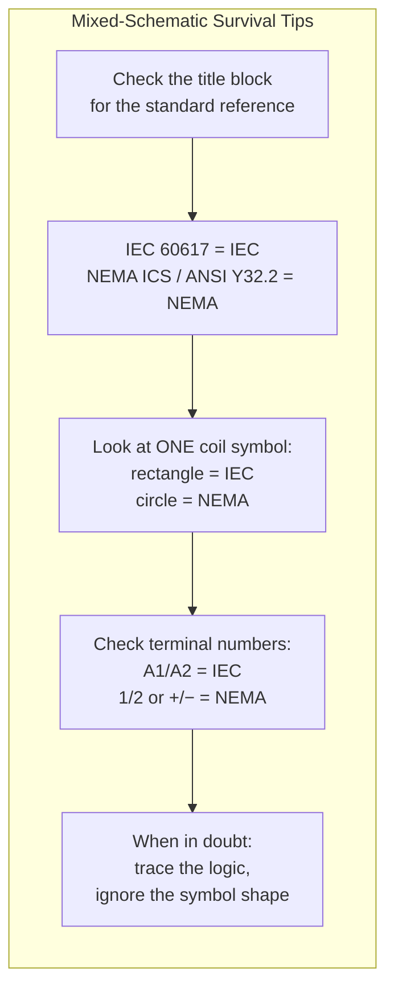

# IEC vs NEMA — What Actually Matters When Reading Schematics

## Thinking Pattern

> **IEC and NEMA are different dialects of the same language.** The logic is identical. The symbols and layout conventions are slightly different. If you can read one, you can read the other — but you'll get tripped up if you don't know what changed.

The key differences:
| Aspect | IEC | NEMA / ANSI |
|--------|-----|-------------|
| Symbol style | Minimal, geometric | More pictorial, detailed |
| Component labels | K, Q, F, S (letters = function) | CR, CON, CB, PB (letters = device) |
| Coil drawing | Rectangle (without wires to corners shown for relays), or with semicircle for old standard | Circle or semi-circle with wires |
| Terminal drawing | Small circle or dot | Small rectangle or dot |
| Contact gap | Drawn with a gap (open) or line through (closed) | Line with small circle at the joint for NC |
| Layout | More compact, rungs closer | More spread out, larger symbols |
| Page numbering | Wire numbers by function | Wire numbers by page |

## Symbol Comparison

### Coils

| Device | IEC | NEMA |
|--------|-----|------|
| Relay coil | Rectangle | Semi-circle / circle |
| Contactor coil | Rectangle with arc line | Circle with wires |
| Timer coil | Rectangle with clock symbol | Semi-circle with clock |

### Contacts

| Contact | IEC | NEMA |
|---------|-----|------|
| NO (normally open) | Two parallel lines, slightly offset | Two parallel lines with a 30° offset, or a small gap with semicircle on the moving side |
| NC (normally closed) | Line with a diagonal slash through it | Line with a small semicircle fulcrum, touching a dot at the NC contact |
| Changeover (SPDT) | Three terminals, COM with one path open and one closed | Same, but semicircle fulcrum on the moving arm |

### Pushbuttons

| Type | IEC | NEMA |
|------|-----|------|
| NO PB | Two terminals with a gap; actuator symbol above (vertical line with small circle) | Two terminals with a pushbutton actuator symbol above (vertical line with a bubble) |
| NC PB | Two terminals with a line through; actuator above | Same but with NC line |
| Mushroom head | Same as PB but actuator has a larger circle at the top | Larger mushroom shape on actuator |

**Ladder layout**: An Eaton comparison document (see References) shows that the fundamental logic is identical for an across-the-line starter — the only differences are symbol shapes and how coils/contacts are arranged within the same topology.

## Where You'll Find Each

```mermaid
graph TD
    subgraph Geography[Where Each Standard Dominates]
        NEMA[NEMA / ANSI] --> NA[USA, Canada, parts of<br/>Latin America, Japan]
        IEC[IEC 60617 / 81346] --> EU[Europe, Middle East,<br/>Africa, Asia, Australia]
    end
    
    subgraph RealWorld[Real-world mixing]
        Mixed1[US-based multinationals<br/>often use IEC for global products]
        Mixed2[European machines<br/>installed in the US<br/>come with IEC schematics]
        Mixed3[Modern panels increasingly<br/>mixed — PLC from Germany (IEC)<br/>power distribution from US (NEMA)]
    end
```

**The reality**: You WILL encounter both. A European machine installed in a US factory comes with IEC schematics. A US-designed machine with German components has mixed symbols. The skill is recognising which standard you're looking at.

## Terminal Numbering Differences

### Relay/Contactor Terminals

```
              IEC                          NEMA
       A1 ────[coil]──── A2         + ────[coil]──── -

  Contact numbers:              Contact numbers:
    11 = COM (pole 1)             1 = COM (pole 1)
    12 = NC (pole 1)              2 = NC (pole 1)
    14 = NO (pole 1)              3 = NO (pole 1)
    21 = COM (pole 2)             4 = COM (pole 2)
    22 = NC (pole 2)              5 = NC (pole 2)
    24 = NO (pole 2)              6 = NO (pole 2)
```

The logic is the same: odd numbers are one side, even are the other. But the specific numbering is different. When replacing a relay in a panel, you MUST match the terminal numbering of the socket — a DPDT relay with IEC terminal numbers won't directly replace one with NEMA terminal numbers even if the pin spacing is the same.

### Coil Terminals

| | IEC | NEMA |
|--|-----|------|
| Coil positive / mains | A1 | + (or terminal 1) |
| Coil negative / neutral | A2 | - (or terminal 2) |

## Practical Tips for Mixed Schematics



**The #1 rule**: The logic is the same regardless of standard. A normally open contact is a normally open contact — it closes when its coil is energised. Whether it's drawn as two offset lines (IEC) or a gap with a semicircle (NEMA) doesn't change the circuit behaviour. Trace the logic, not the symbol aesthetics.

## Cross-References

- [[sc-diagram-types]] — diagram types and where each standard is used
- [[sc-symbols-labels]] — complete reference code table (IEC + NEMA)
- [[sc-reading-ladder]] — tracing method (works identically for both standards)
- [[sc-cheatsheet]] — the decode method
