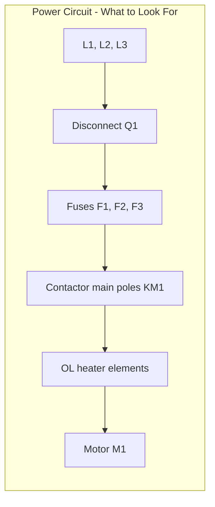
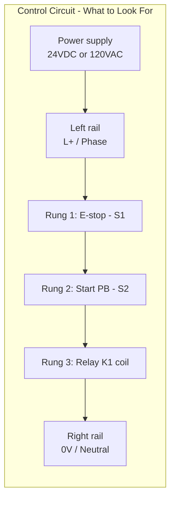
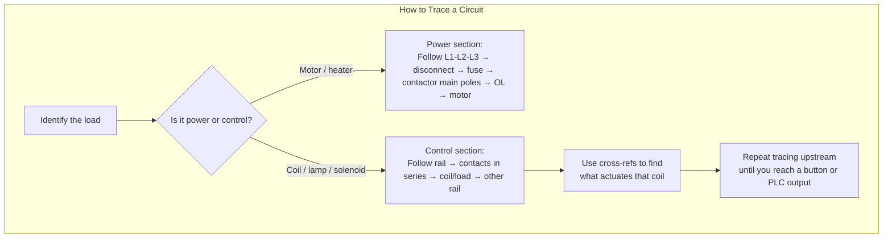

# Reading Ladder Diagrams — Power vs Control, Tracing, Cross-Refs

## Thinking Pattern

> **Every ladder diagram has two sections: the POWER section (top, thick lines, carries load current) and the CONTROL section (bottom or separate page, thin lines, carries coil/signal current).** Learn to separate them in your head and you'll never be lost again.

```
 PAGE 1: POWER CIRCUIT                   PAGE 2: CONTROL CIRCUIT
                                       ┌─ +24V ────────────────── 0V ─┐
 L1 ───[Q1]───[F1]───[KM1]───[OL]─── M1 │    │                        │
 L2 ───[Q1]───[F1]───[KM1]───[OL]─── M1 │  [E-stop]──[K1]             │
 L3 ───[Q1]───[F1]───[KM1]───[OL]─── M1 │    │                        │
                                         │  [Start]──[K1]──[KM1]     │
                                         │    │                        │
                                         │  [Stop]──[KM1]             │
                                         │    │                        │
                                         │  [KM1 aux]──[HL-green]     │
                                         └────────────────────────────┘
```

The power circuit carries the "heavy" current — motor current, heater current. The control circuit carries only the coil current (typically 24V, a few hundred mA). They're separated by the contactor: the coil is in the control circuit, the main contacts are in the power circuit.

## Step 1: Identify the Power Section

The power section is usually:
- At the **top of the first page** (IEC standard)
- Drawn with **thicker lines** or bolder traces (on many drawings)
- Fed directly from the mains (L1, L2, L3) through a disconnect switch or MCCB
- Contains: breakers, fuses, contactor main poles, overload heaters, and the motor/heater/load



**What's NOT in the power section**: pushbuttons, relay coils, PLC I/O, pilot lights, solenoid coils. Those all live in the control section.

## Step 2: Identify the Control Section

The control section is:
- **Below** the power section on the same page, or
- **On separate pages** (common in complex drawings)
- **Drawn between two vertical rails**: a +24V (L+) rail on the left and 0V (N) rail on the right — or 120V phase and neutral
- Contains: pushbuttons, selector switches, relay/contactor coils, PLC I/O, timer coils, pilot lights, solenoid valve coils

**The power supply for the control section**:
- Always check how the control voltage is derived
- Often from a **control transformer** (T1) fed from the power section phase-to-phase (e.g., 480V → 120V) or phase-to-neutral (230V → 24V)
- Or from a **power supply** (PSU) if it's DC control (230V AC → 24V DC)
- The transformer/PSU symbol is usually at the top-left of the control section



## Step 3: Trace Top-to-Bottom, Left-to-Right Per Rung

Each rung is a complete circuit from the left rail to the right rail:

```
Rung 1:   L+ ──[S1 E-stop NC]────[S2 Start NO]────[K1 coil]──── 0V
Rung 2:   L+ ──[K1 contact]──────[K3 NC]──────────[KM1 coil]─── 0V
Rung 3:   L+ ──[KM1 contact]──────────────────────[M1 lamp]─── 0V
```

**Reading order**:
1. Rung 1 executes first: If E-stop is closed (not pressed) AND Start is pressed, K1 energises
2. Rung 2: If K1 is energised (its contact closes) AND K3's NC is closed (not energised), KM1 energises
3. Rung 3: If KM1's contact is closed, the motor indicator lamp turns on

The diamond is: **the contact of a component can be on a DIFFERENT rung than the coil**. K1's coil is on rung 1, but K1's contact that does something useful is on rung 2.

**This is the single most important skill**: finding where a coil's contacts are used. That's what cross-referencing is for.

## Step 4: Cross-Referencing

On IEC ladder diagrams, each coil has a cross-reference column to the right of the drawing that tells you exactly where its contacts are:

```
       Coil       NO contacts     NC contacts
    ┌──────────┐ ┌────────────┐ ┌────────────┐
    │  K1      │ │  2, 4, 7   │ │  5, 8      │
    │  KM1     │ │  3, 6      │ │  ---       │
    └──────────┘ └────────────┘ └────────────┘
```

This means: "K1 has NO contacts on rungs 2, 4, and 7; NC contacts on rungs 5 and 8."

On NEMA drawings, the cross-reference is formatted differently — typically as contact numbers or page/line references beside the coil.

### How to Use Cross-Refs in Practice

1. Find the coil you're interested in (say KM1 on rung 3)
2. Look at its cross-ref column: "NO: 5, 8" — KM1 has NO contacts on rungs 5 and 8
3. Flip to rung 5: you see KM1's contact closing to energise the motor
4. Flip to rung 8: you see KM1's contact closing to turn on the green "running" lamp

Without cross-refs, you'd need to scan every rung looking for "KM1". With cross-refs, you go directly to the rungs that matter.

## Step 5: Apply the Power/Control Split to Tracing



**Example trace**: "Why won't the pump motor M1 start?"

1. M1 is in the power section — check that Q1 (disconnect) is closed, fuses F1-F3 are good, overload OL is not tripped, contactor KM1's main poles are pulled in
2. KM1's coil is in the control section — cross-ref shows KM1 coil is on rung 5
3. Rung 5: `L+ ──[K1 contact]──[S2 NC stop]──[S3 NO start]──[KM1 coil]── 0V`
4. For KM1 to energise: K1 must be energised (so K1's contact is closed), S2 (stop) must NOT be pressed (NC), S3 (start) must be pressed (NO)
5. Now trace K1: cross-ref shows K1 coil is on rung 2
6. Rung 2: `L+ ──[S1 E-stop NC]──[S4 NO auto start]──[K1 coil]── 0V`
7. For K1 to energise: S1 (E-stop) must NOT be pressed, S4 must be pressed
8. If S4 is not pressed, that's why the pump won't start

**The key insight**: You work backwards from the load (motor → contactor → coil → its upstream contacts → those coils → their contacts → the pushbutton or PLC output). Each step uses cross-refs to jump between rungs.

## Traps in Reading Ladder Diagrams

### 1. Multiple Contact Sets on the Same Rung

```
L+ ──[K1 NO]──[K2 NO]──[K3 NC]──[KM1 coil]── 0V
```

This is an AND condition: ALL of K1, K2 must be energised AND K3 must NOT be energised for KM1 to turn on. The order doesn't matter electrically (they're in series), but the schematic convention is to put the input/condition contacts first and the output coil last.

### 2. Parallel Branches

```
L+ ──┬──[K1 NO]──────────┬──[KM1 coil]── 0V
     │                   │
     └──[K2 NO]──[K3 NO]─┘
```

This is an OR with AND: KM1 turns on if (K1 is on) OR (K2 AND K3 are both on). Parallel lines are OR, series on the same line is AND.

### 3. Wire Numbers ≠ Terminal Numbers

Wire number 105 on the schematic connects to terminal 105 on the terminal block and wire marking 105 on the physical wire. But wire numbers are **assigned by the circuit function** (IEC) or **by page** (NEMA) — they're NOT the same as the component's internal terminal numbers (e.g., 13, 14, A1, A2). Wire numbers appear on lines; terminal numbers appear on the component symbol itself.

### 4. Components Drawn in De-Energised State

The hardest habit to build: **the schematic shows the circuit with ALL power off, ALL pushbuttons not pressed, ALL relays de-energised, ALL limit switches in their unactuated position**.

A limit switch labelled NC and drawn with a closed contact? It's closed when nothing is touching it. When the machine part pushes the limit switch actuator, the contact opens.

A relay's NC contact drawn closed? That's what happens when the coil has no power. Energise the coil, and that NC contact opens.

### 5. The Contactor Interlock (Mechanical)

For reversing motor starters (two contactors — one for forward, one for reverse), there's a **mechanical interlock** between the two contactors that prevents both from being energised simultaneously. On the schematics, you'll also see **electrical interlocks** — each contactor's NC auxiliary contact is in series with the other's coil circuit. But the mechanical interlock is NOT shown on the schematic. You have to know it exists from the contactor datasheet or the panel arrangement drawing.

## Cross-References

- [[sc-diagram-types]] — how ladder diagrams fit among other types
- [[sc-symbols-labels]] — component letter codes and terminal numbering
- [[sc-cheatsheet]] — the complete decode method
- [[sc-contactors]] — interlocking, reversing starters, motor circuits
