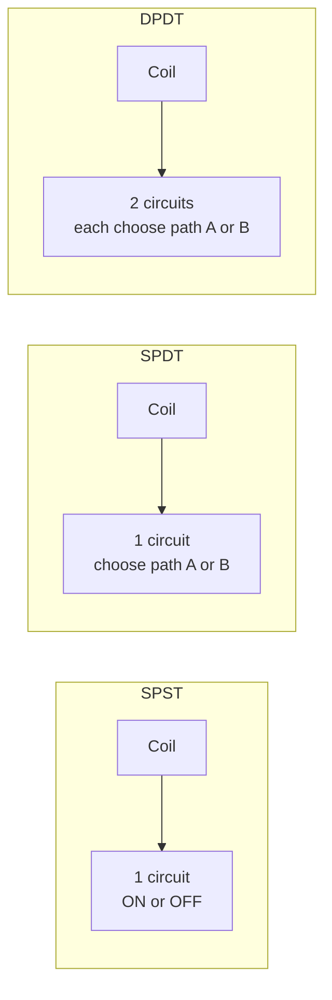
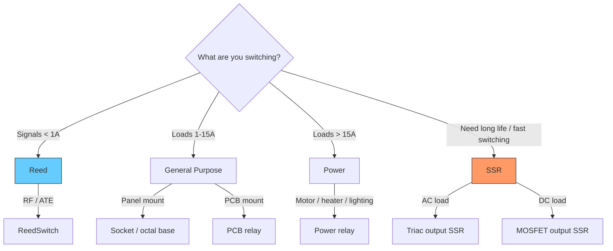
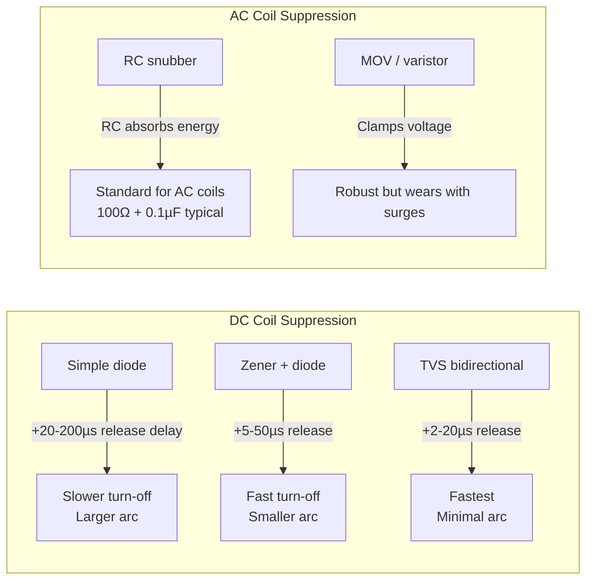
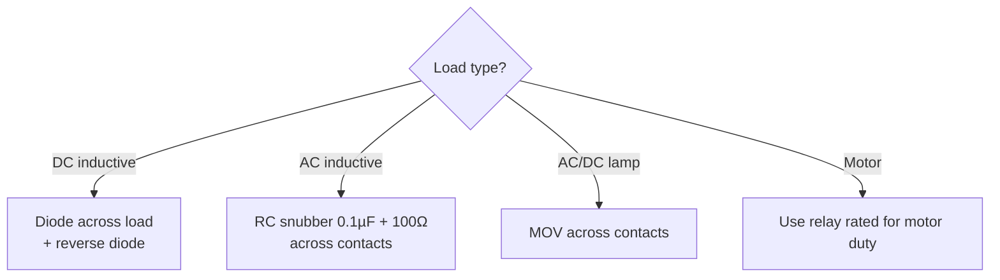
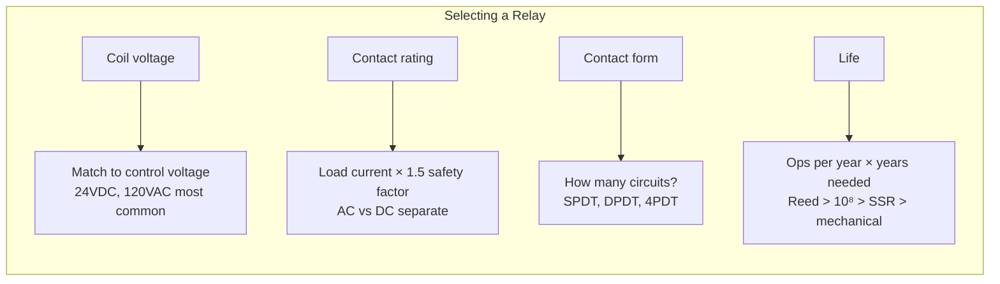

# Relays

## Thinking Pattern

> **A relay is a remote-controlled switch.** The coil is the control input (low power), the contacts are the output (high power). They are electrically isolated — that's the entire point.

```
Coil terminals ---[electromagnet]--->
                                       \
                                        >---- mechanical linkage ----> contacts
                                       /
Other side of coil -------------------/
```

When current flows through the coil, the magnetic field pulls an armature that physically moves the contacts. No direct electrical connection between input and output — only magnetic linkage through air.

## Poles & Throws

```
     SPST                  SPDT                 DPST                 DPDT
  ,---.                 ,---.                ,---.                ,---.
  |   |  COM--o   o--NO |   | COM--o   o--NO |   |COM1--o   o--NO1|   |COM1--o   o--NO1
  |   |                 |   |          o--NC |   |COM2--o   o--NO2|   |COM2--o   o--NO2
  |   |                 |   |                |   |                |   |          o--NC1
  `---'                 `---'                `---'                `---'          o--NC2
```



| Term | Meaning | Analogy |
|------|---------|---------|
| **Pole** | How many separate circuits the relay controls | Number of independent switch levers ganged together |
| **Throw** | How many output paths each pole can connect to | Number of positions each lever can take |
| **Form A** | SPST-NO — open at rest, closed when energised | Door that's closed only when you push |
| **Form B** | SPST-NC — closed at rest, open when energised | Door that's open only when you push |
| **Form C** | SPDT — one NO + one NC share a common terminal | Railway switch — train goes one way or the other |

**About the COM terminal**: COM is the *moving contact* — the armature itself. It's the input side of the switch; NO and NC are the two possible output paths. When the coil is off, COM touches NC. When the coil is on, COM touches NO. Think of it as a railway switch: the train (current) enters at COM and the track switches between NC and NO depending on the coil state.

```
Coil OFF:     COM ===== NC
Coil ON:      COM ===== NO

Schematic drawing convention:
  COM----o  o----NO    (Form C: COM + NO + NC on the same pole)
             o----NC
```

In practice: wire your *source* (voltage or signal) to COM, wire your *load* to NO or NC. If you wire the load to COM and the source to NO, it still works — but the convention is COM = common source.

**Critical detail**: Form C is break-before-make by default. The NC contact opens *before* the NO contact closes. For make-before-break (Form D), the contacts overlap briefly — rare, used in some metering circuits.

## Relay Types



| Type | Current range | Life | When to use | Trap |
|------|---------------|------|-------------|------|
| General-purpose | 1-15 A | 10⁵-10⁷ ops | PLC outputs, control logic, general signal switching | Contacts rated *much* lower for DC than AC |
| Power | 15-40 A | 10⁵-10⁶ ops | Heater, lighting, small motor | Must be sized for motor inrush (6-8x running) |
| Reed | <1 A | 10⁸-10⁹ ops | Low-level signals, ATE (Automated Test Equipment — switching test signals between instruments), RF (Radio Frequency — the glass envelope adds minimal parasitic capacitance and inductance) | Cannot switch significant current — contacts weld. The glass reed is fragile — mechanical shock can break it |
| SSR | 1-100+ A | >10⁸ ops | High cycle rates, vibration, temperature control | **Fails short-circuit** — stuck on. Must be heatsinked |
| Latching | 1-30 A | 10⁵-10⁶ ops | Energy meters, battery-powered, smart lighting | Needs polarity-aware pulse drive circuit |
| Safety | 1-10 A | 10⁵-10⁶ ops | E-stop, light curtains, two-hand controls | Forcibly guided contacts — NO/NC can never both be closed |
| Time-delay | 1-15 A | 10⁵ ops | Sequencing, star-delta transition, pump alternation | On-delay vs off-delay confusion is the most common misapplication |

## Coil Drive & Suppression



**Selection rule for DC**: If release time doesn't matter, use a simple flyback diode (1N400X). If you need fast contact opening (inductive load breaking, safety circuit), use a Zener clamp — pick Zener voltage 1.5-2× the coil voltage.

**Trap**: A standard flyback diode multiplies the release time by 3-10× because the coil current circulates through the diode until the magnetic energy decays naturally. The contacts separate *slowly*, drawing a longer arc on the next opening.

## Arc Suppression on Contacts

DC arcs are persistent — no zero-crossing to extinguish them. AC arcs self-extinguish at the zero crossing.



**Rule of thumb**: The DC contact rating is typically 20-30% of the AC rating for the same relay. A relay rated 10 A at 250 VAC might only be rated 0.5 A at 125 VDC. Always check the DC rating in the datasheet.

## Snubbers

A snubber is a simple circuit that absorbs the energy spike created when an inductive circuit is interrupted. Without it: the voltage spike from coil or contact arcing causes EMI, damages the driver, or welds contacts.

### RC Snubber (Most Common)

A resistor in series with a capacitor, placed *across* the switching contacts or *across* the load:

```
           ,---[R]---[C]---.
          |                |
Load -----+                +----- Supply
          |                |
          '----[Switch]----'
```

**How it works**: When the switch opens, the load's magnetic field tries to sustain current. Instead of arcing across the opening switch contacts, the current flows into the capacitor through the resistor, charging it. The resistor limits the discharge current when the switch closes again.

**Typical values** (for 24-230 VAC loads):
- $R = 100\ \Omega$, $C = 0.1\ \mu\text{F}$ (industrial standard)
- $R = 10-47\ \Omega$, $C = 0.01-0.1\ \mu\text{F}$ (low-voltage DC)
- Power rating: $P_R = C \times V^2 \times f$ — for 0.1 µF, 230 V, 50 Hz: $P_R = 0.1 \times 10^{-6} \times 230^2 \times 50 = 0.26\ \text{W}$ (use 0.5 W minimum)

**Selection rules**:
- $C$ must be large enough to absorb the load's inductive energy: $C > \frac{L \cdot I^2}{V^2}$
- $R$ must limit the peak discharge current when the switch closes: $R > \frac{V_{supply}}{I_{max}}$
- The RC product $\tau = RC$ must be < the switching period's off-time (otherwise the capacitor doesn't discharge fully between cycles)

**Where to place it**:
| Placement | Effect |
|-----------|--------|
| Across switch contacts | Suppresses contact arc — extends relay/switch life. Does nothing for load ringing |
| Across load (inductive) | Suppresses load ringing and reduces EMI. Slows load current decay |
| Across relay coil | Suppresses coil flyback — required for AC coils, optional for DC (diode is simpler) |

### MOV (Metal Oxide Varistor)

A voltage-dependent resistor that clamps spikes above its rated voltage:

- **Pros**: High energy absorption, fast response (~ns), works for AC and DC
- **Cons**: Wears with each surge (gradually degrades), higher leakage current than RC, can fail short-circuit (and catch fire)
- **Placement**: Across the load or across the contacts
- **Selection**: MOV voltage rating = 1.2-1.5 × peak system voltage

### Diode (DC Only)

Simple flyback diode across a DC inductive load:

- **Pros**: Zero EMI (current recirculates silently), cheap, zero steady-state power
- **Cons**: Slows current decay by 3-10× (longer contact arc on opening), DC polarity must be observed
- **Placement**: Across the load (cathode to +VE, anode to -VE)

### When to Use What

| Situation | Recommended snubber | Reason |
|-----------|-------------------|--------|
| AC relay coil (contractor/relay) | RC snubber across coil | Standard, works with AC, no polarity |
| DC relay coil | Flyback diode (or Zener+diode for fast release) | Simplest, zero EMI |
| AC inductive load (solenoid, small motor) | RC snubber across contacts | Suppresses contact arc, extends relay life |
| DC inductive load (brake clutch, solenoid) | Diode across load | Zero EMI, load recirculates silently |
| Thyristor/triac driving inductive load | RC snubber across the thyristor | Prevents dV/dt false triggering (the RC limits the voltage rise rate across the thyristor during commutation — critical for reliable operation) |
| EMI-sensitive circuit | RC snubber | Smooths the waveform, reduces radiated noise |

## Key Datasheet Parameters



| Parameter | What to look for |
|-----------|------------------|
| **Pick-up voltage** | Must be ≤ 75% of nominal. If your 24V supply droops to 18V after a brownout, the relay drops out |
| **Drop-out voltage** | Typically 10-30% of nominal. Relevant for off-delay and undervoltage release |
| **Max switching power** | This is the limit. Exceeding it welds contacts even if voltage and current are individually within rating |
| **Electrical endurance** | 10⁵ at full load vs 10⁷ at 0.1× load. If you're switching a 100W load with a 2000W-rated relay, life is much longer |

## Cross-References

- [[sc-contactors]] — when to use a contactor instead of a relay
- [[pe-m1-switching-devices]] — solid-state relay internal structure (triac, MOSFET)
