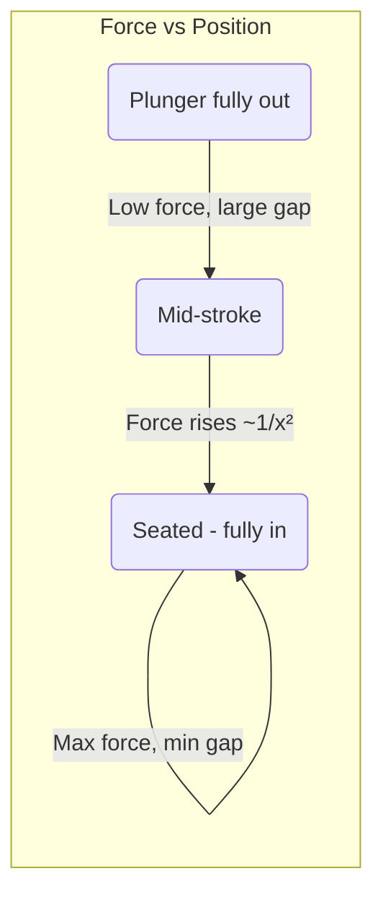
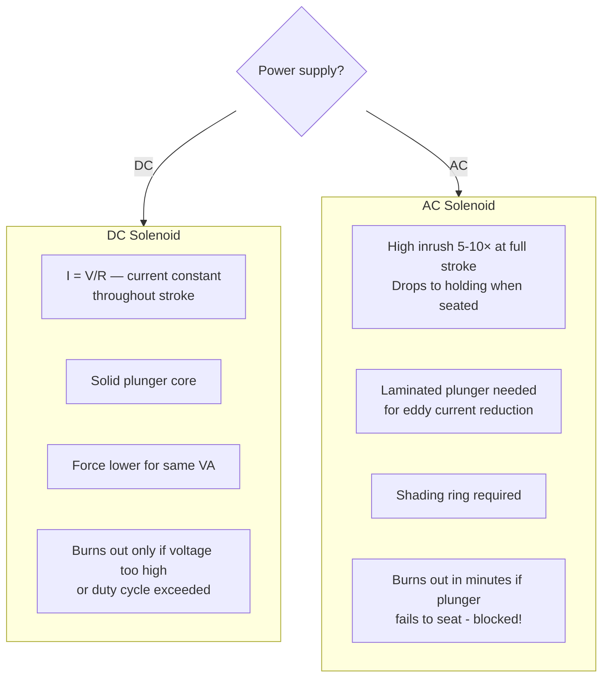
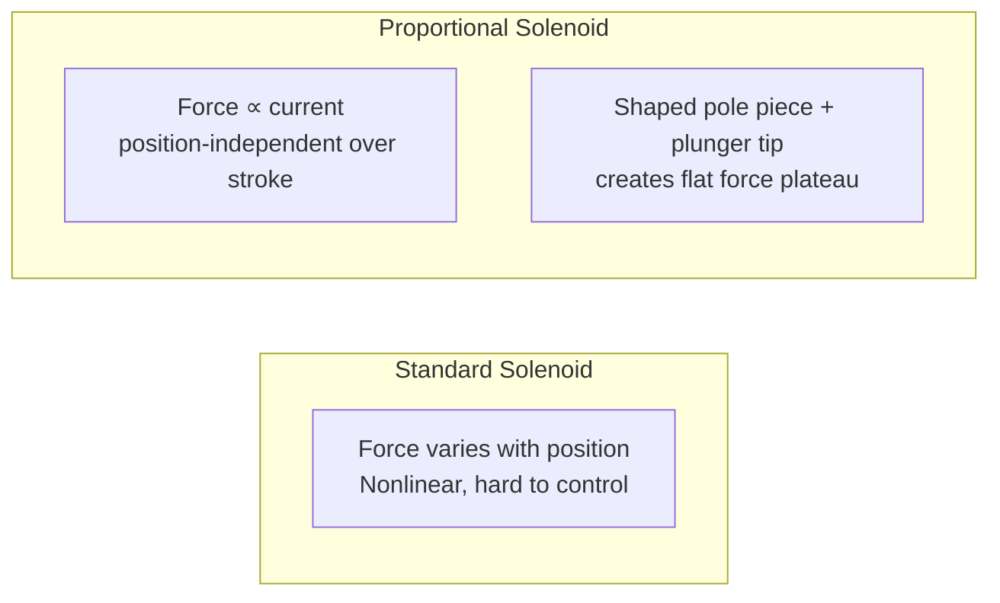
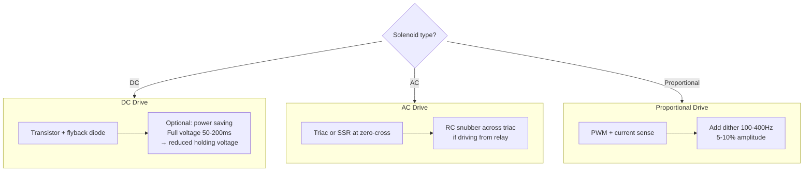

# Solenoids & Linear Actuators

## Thinking Pattern

> **A solenoid is a coil that pulls metal.** Current through the coil creates a magnetic field; the field pulls a ferromagnetic plunger into the coil centre. The force drops off steeply with distance — about $1/x^2$ where $x$ is the air gap.

```
           PLUNGER OUT (low force)
    ,---------------------------------------.
    |  [||||||||||| coil |||||||||||]        |
    |                  <--- plunger ---      |
    |  [||||||||||| coil |||||||||||]        |
    `---------------------------------------'
           PLUNGER IN (high force)
    ,---------------------------------------.
    |  [||||||||||| coil |||||||||||]        |
    |  <--- plunger --->                    |
    |  [||||||||||| coil |||||||||||]        |
    `---------------------------------------'
```

The magnetic circuit has an air gap at the plunger face. As the plunger moves in, the gap shrinks, reluctance drops, and the force increases dramatically.

## Force-Stroke Characteristic



The force is not linear — it's roughly hyperbolic. At 50% stroke, the force might be only 25% of the seated force. This matters for:
- **Pull-in**: The solenoid must produce enough force at full stroke to overcome the load's opposing force (spring, friction, pressure).
- **Hold**: Once seated, much less current is needed to maintain position. This is why "power saving" drive circuits are useful.

## AC vs DC Solenoids



**The single most important trap in solenoid engineering**: An AC solenoid that cannot fully seat (mechanical blockage, insufficient force) draws inrush current *continuously* and burns out within minutes. DC solenoids do not have this failure mode — current is resistance-limited regardless of position.

| Aspect | DC Solenoid | AC Solenoid |
|--------|-------------|-------------|
| Current vs stroke | Constant | High at full stroke, low when seated (5-10× ratio) |
| Plunger core | Solid steel | Laminated (thin sheets) — reduces eddy current heating |
| Shading ring | Not needed | Essential — prevents 100/120 Hz buzz |
| Force for same VA | Lower | Higher (due to high inrush) |
| Failure mode | Coil open from sustained overheat | Shading ring or coil burn from unseated plunger |

## Duty Cycle

| Duty | Max ON time / cycle | Application examples |
|------|---------------------|----------------------|
| 100% (continuous) | Unlimited | Valve holding, brake release |
| 50% (intermittent) | 30 s / 60 s cycle | Sorting gates, short-stroke actuation |
| 25% (intermittent) | 15 s / 60 s cycle | Industrial clamps, positioners |
| Pulse (<10%) | <1 s / 10 s cycle | Pinball flippers, fuel injectors |

**Trap**: Thermal time constant of a typical solenoid is 5-20 minutes. Short bursts above the rated duty cycle are tolerated if the average temperature stays within the insulation class. But "short bursts" every few seconds will eventually overheat — the thermal mass doesn't have time to cool between pulses. The duty cycle rating accounts for this.

## Proportional Solenoids

A proportional solenoid produces force roughly proportional to current, *independent of position* over a limited stroke range. The pole piece and plunger tip are shaped to create a flat force-current plateau.



Used in hydraulic proportional valves, pressure regulators, variable-displacement pumps.

**Drive requirement**: PWM current controller with *dither* — a high-frequency, low-amplitude oscillation (100-400 Hz, 5-10% of PWM amplitude) superimposed on the PWM signal to overcome static friction (stiction). Without dither, the plunger sticks and moves in jerky steps.

## Driving Circuits



**Power saving circuit** (DC solenoid):
1. Apply full coil voltage for 50-200 ms (pull-in phase)
2. Reduce to ~50% of nominal voltage (hold phase)
3. This cuts holding power by ~75% and reduces coil heating significantly
4. Implemented with a capacitor + resistor, PWM, or a second holding coil (dual-coil solenoid)

## Cross-References

- [[sc-relays]] — relay coil drive uses identical suppression techniques
- [[pe-m1-switching-devices]] — SSR structure for AC solenoid drive
