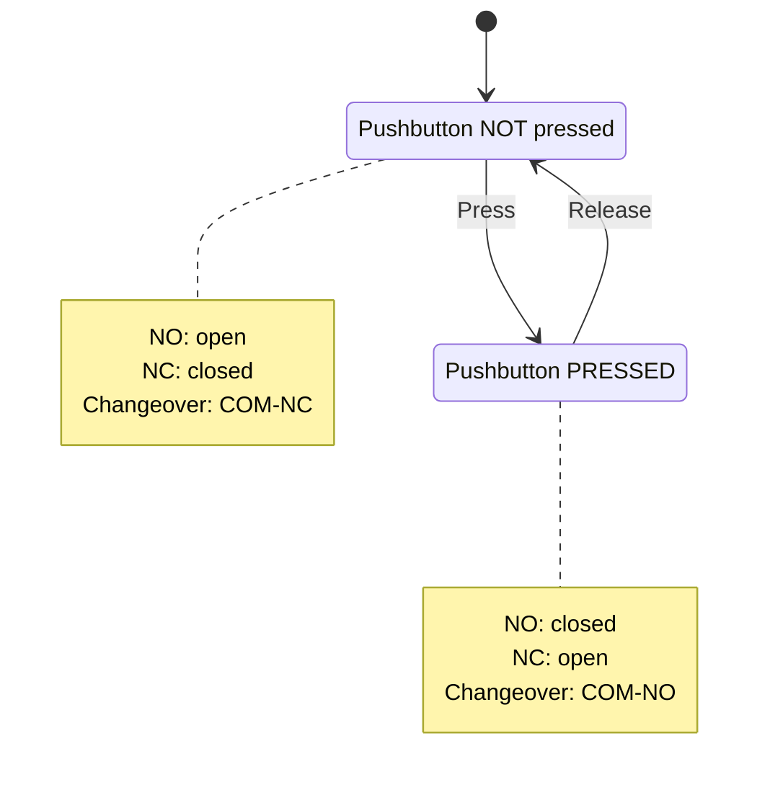
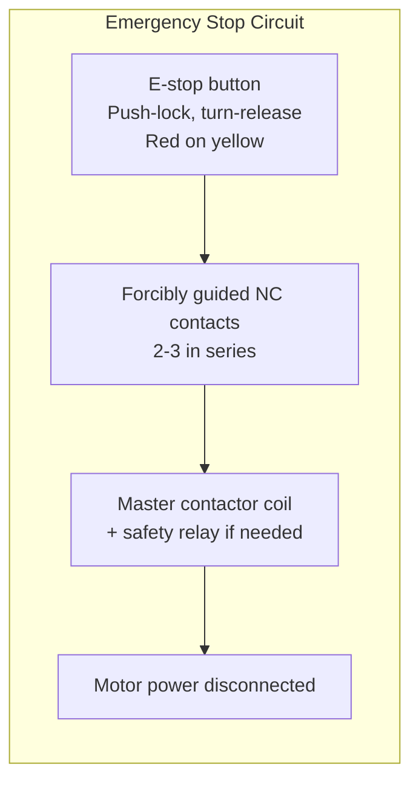
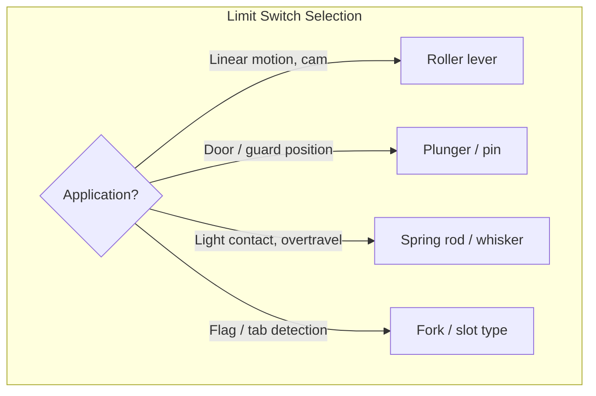
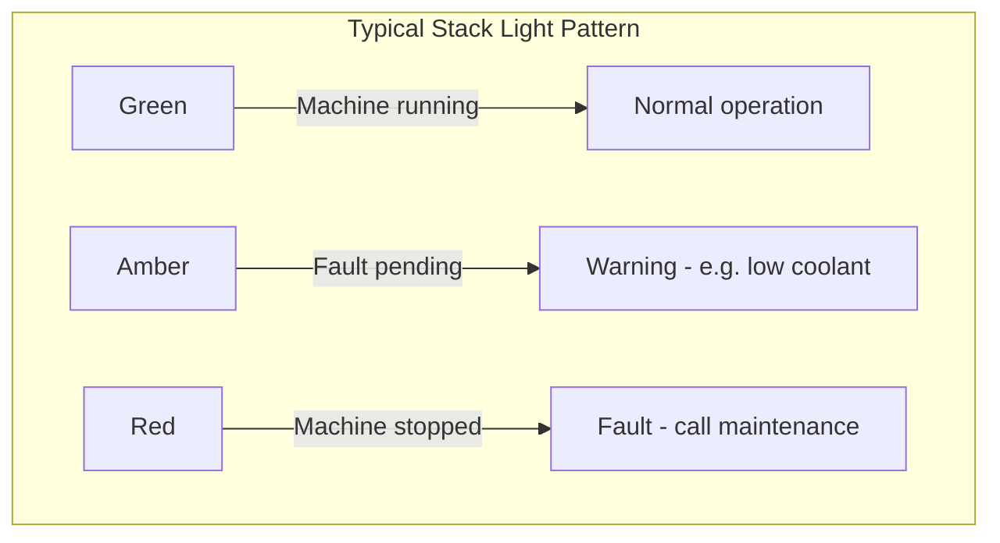

# Switches, Buttons & Indicators

## Thinking Pattern

> **A switch is a mechanical gate — it either blocks or passes current.** The "normal" state (the way it's drawn on a schematic) is always the unactuated state: the button not pressed, the limit switch not contacted, the selector in its leftmost position.

**Drawing convention**: On IEC schematics, switches are always shown in their rest (unactuated) position. NO contacts are drawn open; NC contacts are drawn closed. The actuation method (pushbutton, selector, limit switch) is indicated by a symbol or label beside the contact.

```
NO (Form A):    --o   o--     Open at rest, closes when actuated
NC (Form B):    --o---o--     Closed at rest, opens when actuated
Changeover (C): --o   o--\   COM switches between NO and NC paths
                     o--/
```

## Switch Contact Forms



| Form | Behaviour | Schematic symbol | Example |
|------|-----------|-----------------|---------|
| NO | Open at rest, closes when actuated | `--o   o--` | Start button, floor contact |
| NC | Closed at rest, opens when actuated | `--o---o--` | Stop button, door interlock |
| Changeover | COM to NC at rest, COM to NO when actuated | 3-terminal | Mode selector with indicator |
| Break-before-make (standard) | NC opens *before* NO closes | Guaranteed isolation | Standard relay contact |
| Make-before-break (Form D) | NO closes *before* NC opens | No isolation gap | Metering, test switches |

## Pushbuttons

### Momentary

| Colour | IEC 60204-1 meaning | Typical contact | Actuator colour |
|--------|---------------------|-----------------|-----------------|
| Green | Start / ON | NO | Green |
| Red | Stop / OFF | NC | Red |
| Yellow | Intervention | NO or NC | Yellow |
| White / Grey | General | Any | Black or white |
| Blue | Reset | NO momentary | Blue |

### Illuminated Pushbutton

Two independent circuits in one component:
- **Contact element**: NO and/or NC contacts (same as any pushbutton)
- **Lamp element**: Built-in LED or neon, wired separately

The lamp terminals are electrically independent from the contact terminals. On the schematic, they're drawn as separate symbols with a dashed mechanical link or labelled with the same reference (e.g., S1 contacts + S1 lamp).

### Emergency Stop



- **Push-lock, turn-to-release** (or key-release) mechanism
- **Red actuator on yellow background** per IEC 60204-1 and ISO 13850
- **Forcibly guided contacts**: NO and NC contacts are mechanically linked so they can never both be closed simultaneously. If the NC contacts weld shut, the NO contacts cannot close — the safety circuit detects this.
- **2-3 NC contacts in series**: Provides redundancy. If one contact welds, the other still opens the circuit.

**Critical trap**: An emergency stop does NOT disconnect power from the machine. It interrupts the control circuit, which de-energises the master contactor, which then disconnects power. The E-stop contacts themselves carry only control voltage (24 VDC). The E-stop is a *control device*, not a circuit breaker.

## Selector Switches

| Positions | Contacts | Schematic notation |
|-----------|----------|-------------------|
| 2-position maintained | 1 NO (Off→On) | Contacts shown in Off position |
| 3-position maintained | 2 separate circuits | Left: circuit A closed, Centre: both open, Right: circuit B closed |
| 3-position spring-return | 1 NO + spring to centre | Returns to centre when released |

**Schematic convention**: The selector switch handle is drawn with a dotted line connecting to all contacts. A notch or dot on the dotted line indicates the closed-state position for each contact:

```
Position:       0      1      2
                    \  |  /
Contact 13-14:  o--    |    --o      ← NO, closes in pos 1
Contact 23-24:  o------|------o      ← NO, closes in pos 2
Contact 33-34:  o------|------o      ← NO, closes in pos 2 also
```

## Limit Switches

Actuated by physical contact with a moving part.



| Actuator type | Overtravel | Force required | Typical use |
|---------------|------------|----------------|-------------|
| Plunger (pin) | Minimal | High | Direct vertical actuation |
| Roller lever | Moderate | Moderate | Cam-actuated, slide |
| Whisker / spring rod | High | Low | Light-touch detection |
| Fork / slot | Minimal | Low | Flag presence detection |

**Trap**: Mechanical limit switches wear out (typically 10⁶-10⁷ operations). At 10 operations/second, a limit switch lasts ~12 days. Use a proximity sensor instead for high-speed applications.

## Toggle, Rocker, DIP, Rotary

| Type | Typical contacts | Panel mount? | Best for |
|------|------------------|-------------|----------|
| Toggle | SPDT, DPDT, 4PDT | Yes (threaded bushing) | Control panel manual switches |
| Rocker | SPST, SPDT | Yes (snap-in) | Consumer equipment, power switches |
| DIP | 2-12× SPST | PCB (IC package) | Configuration / address setting |
| Rotary | 2-12 positions, 1-4 poles | Yes (bushing) | Range selection, tap switching |

**Rotary switch truth table**: Each position maps to a set of closed contacts. The table is always given in the datasheet:

| Position | 1-2 | 2-3 | 3-4 | 4-5 | 5-6 |
|----------|-----|-----|-----|-----|-----|
| 0 | ✗ | ✗ | ✗ | ✗ | ✗ |
| 1 | ● | ✗ | ✗ | ✗ | ✗ |
| 2 | ● | ● | ✗ | ✗ | ✗ |
| 3 | ● | ● | ● | ✗ | ✗ |

## Pilot Lights

| Lamp type | Voltage range | Life | Brightness | Notes |
|-----------|---------------|------|------------|-------|
| Incandescent | Specific (24, 120, 230 V) | 1000-5000 h | High | Generates heat, fragile |
| Neon | 90-250 VAC only | >25,000 h | Low-medium | Needs ~90 V to ionise |
| LED | 5-240 VAC/DC (wide) | >50,000 h | High | Robust, low power, wide range |

**Ghost voltage trap**: A pilot light connected to the load side of a contactor can keep the contactor pulled in after the control switch opens, because the lamp's current passes through the contactor coil to neutral instead of through the lamp.

```
    WRONG:                          RIGHT:
  L ----[Switch]----[Lamp]----[Coil]----N      L ----[Switch]----[Coil]----N
                                         (Lamp current keeps                    L ----[Switch]----[Lamp]----N
                                         coil energised)
```

**Solution**: The pilot light must be connected directly from the switched line to neutral (or to the neutral bar directly), NOT in series with the coil.

**LED resistor** (for custom indicators):
$$R = \frac{V_{supply} - V_{LED}}{I_{LED}}$$

Example: 24 V supply, 2 V LED at 20 mA: $R = (24 - 2) / 0.02 = 1100\ \Omega$ (use 1.2 kΩ, 0.5 W).

## Buzzers

| Type | Sound level | Current | Best for |
|------|-------------|---------|----------|
| Electromagnetic | 70-95 dB | 20-100 mA | Low-cost alerts, AC or DC |
| Piezoelectric | 75-120 dB | 5-20 mA | High-pitch, penetrating alarm, DC only |
| Electronic horn | 100-120 dB | 50-500 mA | Fire alarms, evacuation — modulated tone |

Self-oscillating piezo buzzers produce sound when DC is applied. Externally-driven types need a square wave at the resonant frequency.

## Stack Lights (Andon / Signal Towers)

| Colour | IEC 60204-1 meaning | Typical state |
|--------|---------------------|---------------|
| Red | Emergency / fault | Machine stopped, alarm active |
| Amber/Yellow | Warning | Maintenance needed, inching, standby |
| Green | Normal running | Automatic mode, operating normally |
| Blue | Mandatory action | Operator intervention required |
| White | General info | In queue, being serviced, other |



Each module has its own two-wire connection (supply + common). Modules are mechanically keyed to enforce correct colour order from top to bottom.

## Cross-References

- [[sc-relays]] — relay contact forms use same Form A/B/C naming
- [[sc-contactors]] — contactor coil circuits driven by pushbutton/selector logic
- [[sc-terminals]] — wiring terminals used for field device connections
