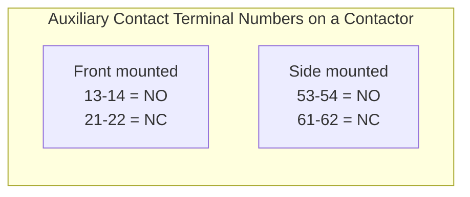

# Symbols, Labels & Reference Codes

## Thinking Pattern

> **Every component on a schematic has a label. That label tells you what the component DOES (letter code) and which instance it is (number).** Learn the letter codes and you can glance at any label and know: "this is a protective device" (F), "this is a relay" (K), "this is a switching device" (S).

## IEC 81346 Letter Codes (What You'll Actually See)

On any IEC schematic, components are labelled with a prefix letter that tells you their class. Multi-letter codes are more specific:

```mermaid
graph LR
    subgraph Codes[Common IEC Reference Codes]
        A[AAssemblies, panels<br/>e.g. A1 = PLC rack] 
        B[B - Converters<br/>e.g. B1 = transducer]
        F[F - Protective devices<br/>F1 = fuse, F2 = MCB, F3 = OL relay]
        K[K - Contactors, relays<br/>K1 = relay, KM1 = contactor, KA1 = aux relay]
        M[M - Motors<br/>M1 = pump motor, M2 = fan motor]
        Q[Q - Switching devices<br/>Q1 = MCCB, Q2 = disconnect switch]
        S[S - Switches, pushbuttons<br/>S1 = start, S2 = stop, SQ1 = limit switch]
        T[T - Transformers<br/>T1 = control transformer, TA1 = CT]
        X[X - Terminals, connectors<br/>X1 = terminal block, XS1 = socket]
        Y[Y - Solenoids, actuators<br/>Y1 = solenoid valve, YA1 = clutch]
    end
```



### Quick Reference Table

| Code | Component class | Examples you'll see | Schematic symbol area |
|------|----------------|-------------------|----------------------|
| **A** | Assemblies, sub-assemblies | A1 = PLC, A2 = VFD, A3 = power supply | Usually a dashed box |
| **B** | Converters, transducers | B1 = pressure transducer, B2 = RTD | Control section |
| **F** | Protective devices | F1 = fuse, F2 = MCB, F3 = OL relay, FA1 = surge protector | Power input / motor branch |
| **K** | Contactors, relays | K1 = relay, KM1 = motor contactor, KA1 = auxiliary relay, KT1 = timer | Control section (coils) + cross-ref to contacts |
| **M** | Motors | M1 = main drive, M2 = coolant pump | Power section |
| **Q** | Switching devices (disconnect, breaker) | Q1 = main switch, Q2 = MCCB, Q3 = load break switch | Power section input |
| **R** | Resistors, potentiometers | R1 = braking resistor | Power section |
| **S** | Switches (control) | S1 = start PB, S2 = stop PB, SQ1 = limit switch, SP1 = pressure switch | Control section inputs |
| **T** | Transformers | T1 = control transformer, TA1 = CT (current), TV1 = VT (voltage) | Power / metering |
| **X** | Terminals, connectors | X1 = terminal strip, XS1 = socket, XP1 = plug | Panel interface |
| **Y** | Solenoids, actuators | Y1 = solenoid valve, YA1 = brake coil, YM1 = actuator motor | Control outputs |
| **Z** | Filters, equalisers | Z1 = EMC filter, Z2 = line reactor | Power input |

**Multi-letter convention**: The first letter is the class (what it does), the second letter narrows it:
- **KM** = Contactor (K = relay/contactor, M = motor switching)
- **KA** = Auxiliary relay
- **KT** = Timer relay (T = time)
- **KF** = Protection relay (F = protective)
- **TA** = Current transformer (T = transformer, A = measuring)
- **SQ** = Limit switch (S = switch, Q = position)
- **SP** = Pressure switch
- **SF** = Flow switch

### NEMA/ANSI Codes (What You'll See in US Drawings)

| NEMA code | IEC equivalent | Component |
|-----------|---------------|-----------|
| **CR** | KA | Control relay |
| **CON** | KM | Contactor |
| **M** | KM | Motor starter coil |
| **TR** | KT | Timer |
| **CB** | QF | Circuit breaker |
| **FU** | FU | Fuse |
| **OL** | F (or no code) | Overload relay |
| **PB** | SB | Pushbutton |
| **LS** | SQ | Limit switch |
| **SOL** | YV | Solenoid |
| **LT** | HL | Pilot light |
| **T** | XT | Terminal |

## Terminal Numbering (Relay & Contactor)

Relays and contactors follow standard terminal numbering conventions. This tells you which terminals are NO, NC, and COM without checking the datasheet.

### IEC Relay Terminal Numbers (EN 50011 / EN 50005)

```
Coil:     A1 (+)  ──────[ coil ]──────  A2 (-)

Contact numbering:
  Poles start with:
    1, 2, 4  = first pole (1 = common, 2 = NC, 4 = NO)
    5, 6, 8  = second pole (5 = common, 6 = NC, 8 = NO)
    9, 10, 12 = third pole ... pattern continues

  Examples:
    K1-11, K1-12, K1-14  = first pole of relay K1
                           11 = COM, 12 = NC, 14 = NO
    K1-21, K1-22, K1-24  = second pole of relay K1
                           21 = COM, 22 = NC, 24 = NO
```

| Terminal | Function |
|----------|----------|
| A1 | Coil positive (or mains) |
| A2 | Coil negative (or neutral) |
| 11, 21, 31... | COM of each pole |
| 12, 22, 32... | NC of each pole |
| 14, 24, 34... | NO of each pole |

**Pattern**: Tens digit = pole number (1, 2, 3...). Units digit = 1 (COM), 2 (NC), 4 (NO).

### Auxiliary Contactor Terminals



Standard for contactor auxiliary contacts:
- NO: 13-14 (first), 23-24 (second), 33-34 (third)
- NC: 11-12 (first), 21-22 (second), 31-32 (third)
- The lower number is the input, higher is the output (e.g., 13 is COM, 14 is NO)

### IEC MCB Terminal Numbers

| Terminal | Function |
|----------|----------|
| 1, 3, 5 | Line (upstream) — 1 = L1, 3 = L2, 5 = L3 |
| 2, 4, 6 | Load (downstream) — 2 = L1 out, 4 = L2 out, 6 = L3 out |

## Terminal Blocks

Terminal blocks are labelled with the reference of the block (X1, X2...) followed by the pin number:

```
X1:1, X1:2, X1:3...  = Terminal block 1, pins 1 through n
X2:1, X2:2...        = Terminal block 2
```

**Multi-level blocks**: A second digit indicates the row.
```
X1:1-1, X1:1-2  = Row 1, pins 1 and 2
X1:2-1, X1:2-2  = Row 2, pins 1 and 2
```

### End-to-End Wire Numbering

On the schematic, every connection point is assigned a wire number. The numbering scheme tells you something about the circuit:

**IEC-style functional numbering**:
- Wires are numbered per function, not per page
- All +24V wires might be numbered 01, 02, 03...
- All 0V wires might be numbered 11, 12, 13...
- Signal wires numbered 100-199 for analogue inputs, 200-299 for digital, etc.

**NEMA-style page-based numbering**:
- Wire 305 means "page 3, fifth wire on that page"
- 412 means "page 4, twelfth wire"
- Easier for tracing across pages (the number tells you the sheet)

**Trap**: When mixing numbering systems on a retrofit, confusion is guaranteed. If you're replacing an IEC panel in a NEMA facility, the wire numbers won't follow the same logic. Best practice: choose one system and stick with it.

## Cross-References

- [[sc-diagram-types]] — where these labels appear (ladder, SLD, etc.)
- [[sc-reading-ladder]] — how cross-referencing works with these labels
- [[sc-relays]] — relay terminal numbering in context
- [[sc-contactors]] — contactor terminal numbering
- [[sc-cheatsheet]] — the complete decode method
