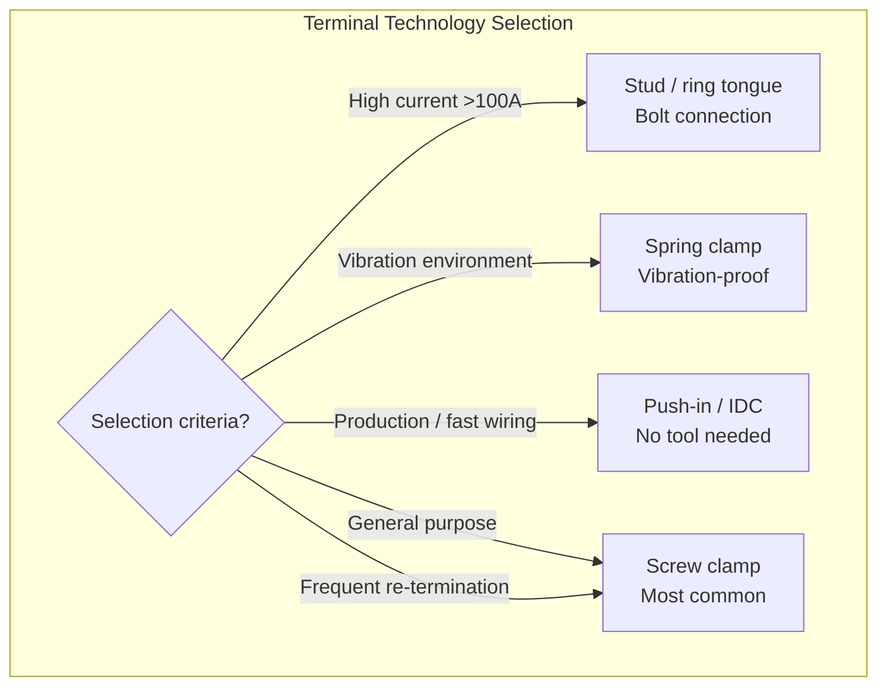
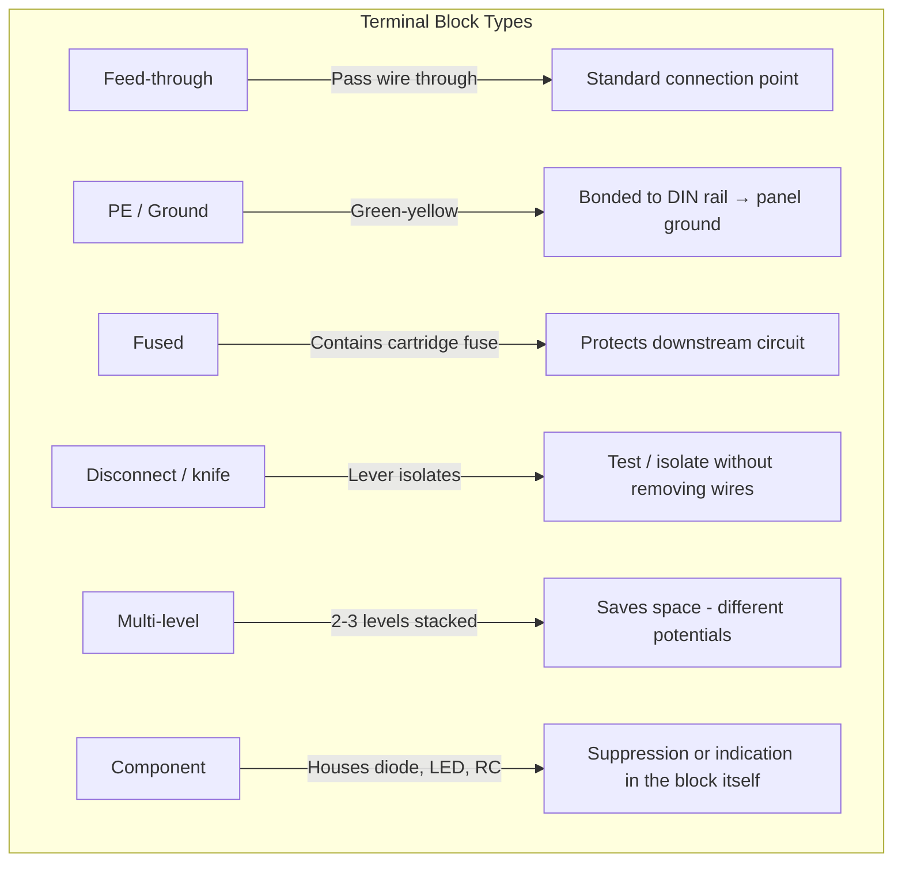
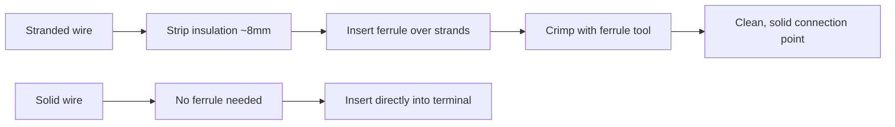

# Terminals & Connectors

## Thinking Pattern

> **A terminal block is a structured junction — wire goes in, connection comes out.** The point of a terminal block is organisation, safety, and serviceability. Without them, control panels become unmaintainable rat's nests. With them, you can trace, test, and replace any circuit independently.

Terminal blocks are the *physical* interface between the schematic's connection points and the real wires.

```
Schematic:   Field device ----[X1:12]----[PLC input module]
                               |
Panel:      Wire from field goes to terminal X1:12
            Jumper from X1:12 goes to PLC input card
            If the field device fails, disconnect at X1:12 without touching the PLC
```

## Terminal Block Connection Technology



| Technology | Tool required | Vibration resistance | Re-termination cycles | Best for |
|------------|---------------|---------------------|----------------------|----------|
| Screw clamp | Screwdriver | Good (cage clamp) | Unlimited | General-purpose, field wiring |
| Spring clamp | Screwdriver (to open) | Excellent | Unlimited | High vibration, fast install |
| Push-in (IDC) | None for solid wire; ferrule for stranded | Excellent | 5-10 | Production, solid wire |
| Stud / ring | Wrench | Excellent | Unlimited | >100 A, lug connections |

## Types of Terminal Blocks



| Type | Colour | Typical use |
|------|--------|-------------|
| Feed-through | Beige/grey | General wiring — wire in, wire out |
| Ground (PE) | Green-yellow | Protective earth connections |
| Neutral (N) | Blue | Neutral bus (where required) |
| Fused | Beige with transparent cover | Fuse protection for control circuits |
| Disconnect | Beige with orange lever | Isolating transmitters, sensors for testing |
| Double-level | Beige (two tiers) | Two separate circuits in one block — saves rail space |
| Component | Beige (larger body) | Diode array for solenoid suppression, RC network |

## DIN Rail

The metal rail that holds everything together.

| Type | Width | Depth | Profile | Used for |
|------|-------|-------|---------|----------|
| **TS35** | 35 mm | 7.5 mm | Top hat | Terminal blocks, MCBs, small contactors, relays, power supplies — **the universal standard** |
| TS35/15 | 35 mm | 15 mm | Top hat (deep) | Heavier contactors, larger breakers |
| TS32 | 32 mm | 15 mm | Top hat (narrow) | Legacy equipment, less common |

**TS35 × 7.5** is the default for almost everything modern. All DIN-rail terminal blocks, MCBs, RCDs, relays with socket bases, and small contactors snap onto TS35 rail.

## Pluggable Connectors

### Terminal Block Plug + Header

The classic green pluggable connector used on PLC I/O modules, power supplies, and control boards:

- **Plug**: Removable half — spring-clamp or screw-clamp wire termination
- **Header**: Fixed half — soldered to PCB or mounted on panel
- **Pitch**: 3.5 mm (signal/PLC I/O), 5.08 mm (power/relay outputs)
- **Keying**: Notched to prevent misplugging (different key positions for different voltage groups)

### Circular Connectors (M8 / M12)

Used for field device connections — sensors, actuators, fieldbus:

| Connector | Pins | Coding | Application |
|-----------|------|--------|-------------|
| M12 | 4 or 5 | A-coded | Sensors, actuators |
| M12 | 4 | B-coded | Fieldbus (Profibus, DeviceNet) |
| M12 | 4 | D-coded | Industrial Ethernet (Profinet, EtherNet/IP) |
| M8 | 3 or 4 | A-coded | Miniature sensors |

### Heavy-Duty Connectors (Han, Harting, etc.)

Rectangular industrial connectors for machine-to-cable interfaces:
- Rated for high current (10-200 A per contact)
- High pin counts (6-216 pins)
- Environmental sealing (IP65/67) — can be used outside the panel
- Crimp or screw termination
- Hood + housing + insert — modular system

## Wire Ferrules

A ferrule is a thin tin-plated copper tube crimped onto the stripped end of a stranded wire.



| Without ferrule | With ferrule |
|----------------|--------------|
| Strands may fray | All strands contained |
| Uneven current distribution | Even current across all strands |
| Strands can short to adjacent terminal | No stray strands |
| Spring clamp may damage strands | Spring clamps on solid tube |

## IDC (Insulation Displacement Connector)

The contact blade pierces the wire insulation to make contact without stripping:
- **Ribbon cable**: Flat cable IDC connectors (DB connectors, pin headers) — common in legacy PLC I/O
- **Terminal blocks**: Some push-in blocks use IDC for solid wire
- **Limitations**: Limited re-termination cycles (1-2), not suitable for fine-stranded wire

## Cross-References

- [[sc-switches-indicators]] — field device wiring via terminals
- [[pe-m11-thermal-emc-layout]] — panel layout, wire routing, segregation
