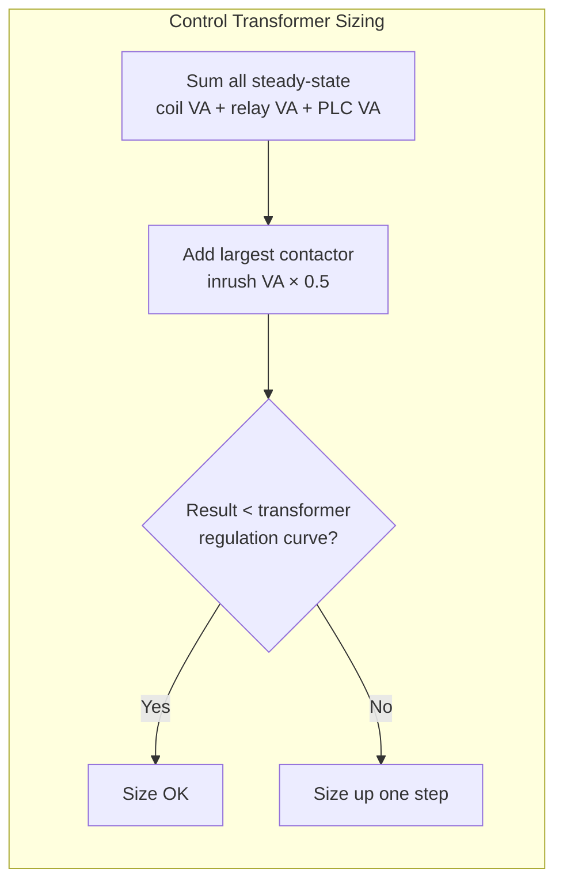
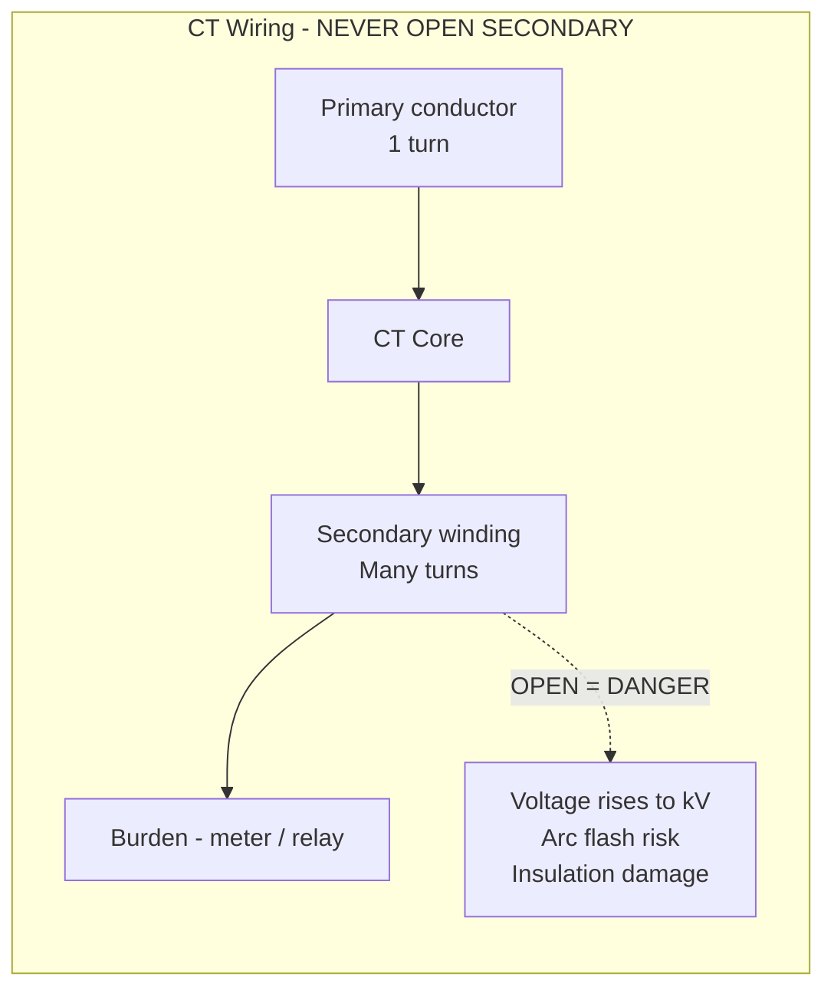
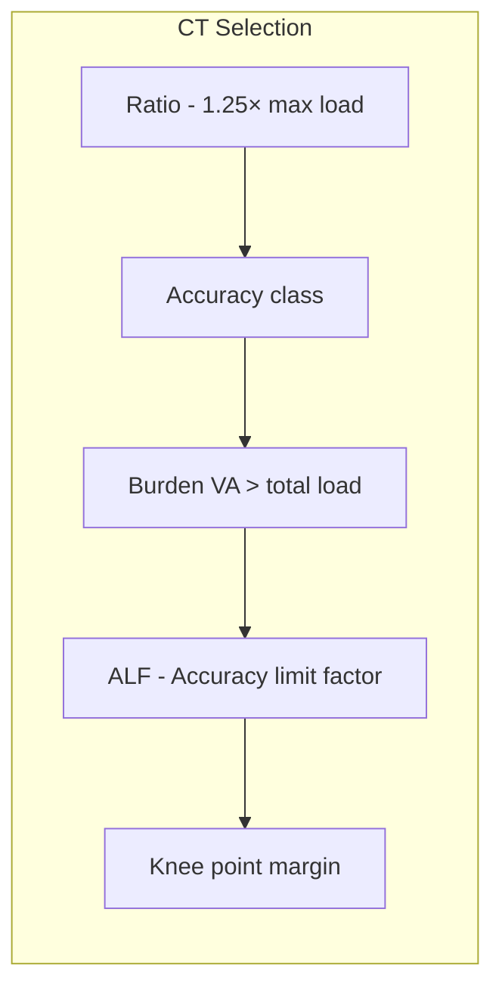
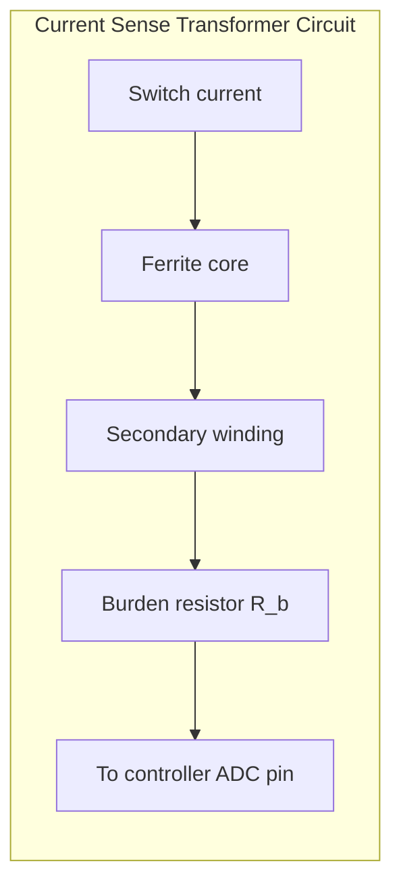

# Signal & Control Transformers

## Thinking Pattern

> **A transformer transfers power or information through magnetic coupling, not direct connection.** The ratio of input to output is determined by the turns ratio ($N_p/N_s$). For power transformers: $V_p / V_s = N_p / N_s$. For current transformers: $I_p / I_s = N_s / N_p$ — the CT is the inverse.

The key distinction: **power transformers** are voltage sources (regulated output), **current transformers** are current sources (output proportional to primary current, independent of burden within limits).

## Control Transformer

A small transformer (50 VA to 5 kVA) providing isolated control voltage (typically 24 V, 120 V from a 230/400/480 V supply).



**Critical trap**: The voltage drop under inrush. A control transformer has ~5% regulation from no-load to full-load. Under contactor coil inrush (5-10× steady-state), the voltage can drop 10-20%. If the voltage falls below 85% of nominal, the contactor may fail to pull in, the contacts chatter, and the shading ring overheats.

**Sizing rule of thumb**:
1. Sum all steady-state VA (relays, PLC power supply, lights)
2. Add the inrush VA of the largest contactor coil
3. Multiply contactor inrush by 0.5 (duty factor — other loads are off during the inrush peak)
4. If the total exceeds the transformer's regulation curve at that point, size up

**Trap**: A control transformer with a 480 V primary and 24 V secondary has a 20:1 turns ratio. A primary-side fault (line-to-line spike, common-mode transient) can induce thousands of volts on the secondary through inter-winding capacitance. A shielded (electrostatic screen) winding between primary and secondary that drains to ground blocks this coupling. Always use a shielded transformer for sensitive electronics.

## Current Transformer (CT)

### Principles



A CT is a transformer with 1 primary turn (the conductor passing through) and many secondary turns. The secondary current is the primary current divided by the turns ratio:

$$I_s = \frac{I_p}{N}$$

Standard secondary ratings: 5 A or 1 A at rated primary current.

**Rule #1**: NEVER open the secondary circuit with primary current flowing. An open CT secondary is a step-up voltage transformer — the voltage rises until it flashes over, destroying the CT and creating a lethal hazard. Always short the secondary terminals if not connected to a load.

**Rule #2**: The burden (total impedance on the secondary) must not exceed the CT's rated burden or the CT saturates, distorting the output waveform.

### Key Parameters



- **Ratio**: Choose primary rating ~1.25× the expected maximum load current. A 600:5 CT on a circuit carrying 120 A runs at 20% of rating — poor accuracy because the core isn't operating in its linear region.
- **Accuracy classes**:
  - **0.2, 0.2S, 0.5**: Revenue metering (class = % error at rated current)
  - **1.0**: Industrial metering
  - **5P10, 5P20, 10P10**: Protection — 5% accuracy at 10× rated current (P = protection, number after P = accuracy limit factor)
  - **TP**: Transient performance — for differential protection, handles DC offset without saturating
- **Burden**: Expressed in VA. The CT must be rated for the total burden (relays + meters + wiring). Under-burdening is fine; over-burdening causes saturation and waveform distortion.
- **ALF (accuracy limit factor)**: The multiple of rated current at which the CT still maintains its accuracy class. A 5P10 CT is within 5% accuracy up to 10× rated current.

### Saturation

CT saturation occurs when the core cannot support the induced voltage required by the burden current. The knee point voltage is the voltage at which the CT saturates:

$$V_{knee} \propto N_s \cdot A_e \cdot B_{max} \cdot f$$

Saturated CT output is *flat-topped* — the secondary current waveform clips. For protection relays, this means:
- Overcurrent relay: operates slower or not at all (current appears lower)
- Differential relay: false differential current → nuisance trip
- Directional relay: gets the direction wrong (phase shift from saturation)

## Voltage Transformer (VT / PT)

Steps down high voltage (3.3 kV to 765 kV) to standard secondary voltage (100-120 V line-to-line, 57.7-63.5 V phase-to-neutral).

- **Burden**: Expressed in VA. Over-burdening causes ratio error and phase angle error.
- **Fusing**: Both primary and secondary must be fused. Primary fuse clears if the VT fails internally. Secondary fuse (typically 2 A) protects against secondary short circuits.
- **Grounding**: The secondary must be grounded at one point. For wye-connected VT banks, the neutral (star point) is grounded. This prevents floating voltages and provides a reference for phase-to-ground measurements.
- **Ferroresonance**: On ungrounded primary configurations, the VT core can resonate with the system capacitance during switching events — producing sustained overvoltages. This is *destructive*.

## Pulse Transformer

Designed to transmit fast voltage/current pulses with minimal waveform distortion. Used for:
- Gate drive isolation for IGBTs, MOSFETs, SiC/GaN FETs
- Triggering thyristors and triacs
- Signal isolation in communication circuits

### Key Parameters

```
Volt-time product:  V·µs = ∫V(t) dt   ← MUST exceed max pulse
Rise time:          <100 ns for gate drive
Isolation voltage:  2.5-10 kV
Leakage inductance: As low as possible
```

**Volt-time product**: The fundamental limit. If the product of pulse voltage and duration exceeds the V·µs rating, the core saturates and the output waveform collapses. For a PWM gate drive at 50% duty, 100 kHz, 15 V:

$$V\cdot t = 15 \times 5\ \mu\text{s} = 75\ \text{V·µs}$$

The pulse transformer must be rated higher than this.

**Trap**: When the pulse transformer saturates, the gate voltage drops below threshold mid-pulse — the power device turns partially on, dissipates excessive power, and fails. Always verify the V·µs rating exceeds the worst-case PWM pulse (including any fault condition where the pulse may stretch to 100% duty).

## Current Sense Transformer

A miniature CT used inside switching power supplies to measure switch current. A small ferrite core with 50-100 secondary turns; the primary is the power conductor or a PCB trace.



- **Burden resistor selection**: $R_b$ converts secondary current to voltage for the controller's ADC
  $$V_{sense} = I_p \cdot \frac{N_s}{N_p} \cdot R_b$$
- **Peak voltage** at maximum primary current must not exceed the ADC input range
- **Reset**: The transformer must fully reset every switching cycle. The core flux returns to zero during the off-time. For a unipolar current sense, this is automatic if the reset voltage across the winding is ≥ the on-time voltage (as in a flyback converter).

## Cross-References

- [[pe-m8-magnetic-design]] — core selection, area-product method, skin effect for transformer design
- [[pe-m1-switching-devices]] — gate drive requirements (pulse transformer for isolation)
- [[pe-m9-power-supply-design]] — transformer selection in power supply, inrush limiting
