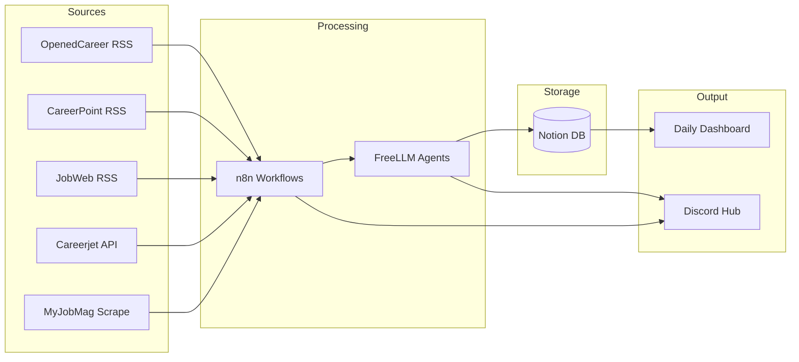

---
tags:
  - moc
  - project
  - job-search
  - n8n
  - discord
  - notion
  - automation
  - kenya
  - agents
aliases:
  - "Job Hunt Ops"
  - "Job Search Infrastructure"
created: 2026-05-21
updated: 2026-05-25
status: active
---

# Job Hunt Ops — Map of Content

> **Discord-first job hunting command center.** n8n automates, FreeLLM agents process, Notion stores, Discord surfaces everything.



## Stack

| Layer | Tool | Role |
|-------|------|------|
| Hub | [[Discord Architecture]] + [[Discord Bot Setup]] | Bot (interactive) + webhooks (automated) |
| Automation | [[n8n Setup & Configuration]] | Workflows, scheduling, webhooks, orchestration |
| Intelligence | FreeLLM (`127.0.0.1:3001`) | Per-task model selection for processing |
| Storage | [[Notion Integration]] | Jobs DB, companies DB, CV, enrichment data |
| Enrichment | [[Data Enrichment Pipeline]] | Two-stage collect → validate pipeline |

## Model Assignment (FreeLLM — 89 models)

| Task | Model | Why |
|------|-------|-----|
| Job feed scanning | `openai/gpt-oss-20b:free` | Fast, cheap, structured extraction |
| Job validation/scoring | `google/gemma-4-31b-it:free` | Reasoning for relevance filtering |
| Cover letter drafts | `mistralai/mistral-large-3-675b-instruct-2512` | Best writing quality |
| Company enrichment | `openai/gpt-oss-120b:free` | Deep research, multi-source |
| Code/scraper logic | `deepseek-ai/deepseek-v4-pro` | Code generation |
| Vision | `mimo-v2-omni` | Screenshots, job images |
| Compression | `gemini-2.5-flash` | Summarization |

## Discord Layout

```
📋 COMMAND CENTER
├── #dashboard          — Daily automated summary (8am EAT cron)
├── #alerts             — Instant high-score job matches
├── #log                — n8n execution logs, errors, health

🎯 JOBS
├── #feed-eee           — Raw EEE job feed (auto-posted)
├── #feed-general       — Adjacent roles (energy, power, automation)
├── #validated          — Agent-scored + vetted (score > 70)
├── #applied            — Application tracking
├── #saved              — Bookmarks

🔬 RESEARCH
├── #companies          — Enriched company profiles
├── #market-intel       — Salary data, hiring trends

📝 MATERIALS
├── #cover-letters      — Agent-drafted CLs, human review
├── #resume-versions    — Tailored resume variants

🤖 AGENTS
├── #agent-status       — FreeLLM health, model availability
├── #agent-playground   — Workflow testing, prompt tuning

💬 GENERAL
├── #strategy           — Career direction, networking
├── #random             — Off-topic
```

## Workflows

| # | Workflow | Trigger | Status |
|---|----------|---------|--------|
| 1 | [[Job Feed Scanner]] | Cron (4h) | Planned |
| 2 | [[Job Validator]] | New message in #feed-eee | Planned |
| 3 | [[Company Enrichment]] | New company in #validated | Planned |
| 4 | [[Daily Dashboard]] | Cron (8am EAT) | Planned |
| 5 | [[Cover Letter Generator]] | React emoji on job | Later |
| 6 | JustHireMe Integration | Manual/cron | Later |

## Notion as Default DB

[[Notion Integration]] replaces flat files as the source of truth:
- **Jobs Database** — all scraped + validated listings
- **Companies Database** — enriched company profiles
- **CV page** — current resume (Canvas for formatting)
- n8n reads/writes via Notion API (HTTP Request nodes)

## Components

| Component | Doc | Status |
|-----------|-----|--------|
| Scraping | [[n8n Setup & Configuration]] | ✅ Running (Docker + Postgres) |
| Sites | [[Kenyan Job Sites — Feeds & Scraping]] | ✅ Researched (8 sites mapped) |
| Discord | [[Discord Bot Setup]] | 🔲 Awaiting bot creation |
| Notion | [[Notion Integration]] | 🔲 Awaiting DB setup |
| Agents | FreeLLM | ✅ Running (89 models) |
| Enrichment | [[Data Enrichment Pipeline]] | ✅ Pattern defined |

## Decisions

- **2026-05-21:** n8n as scraping layer, not rewriting scraping in JustHireMe
- **2026-05-21:** n8n first (feeds), JustHireMe second
- **2026-05-25:** Discord as central hub (not just output)
- **2026-05-25:** Notion as default DB (not flat files, not Postgres for app data)
- **2026-05-25:** FreeLLM with per-task model routing
- **2026-05-25:** Enrichment pipeline pattern (collect → validate → write)

## Progress

- [x] n8n self-hosted on Docker (running, Postgres healthy)
- [x] Map KE job site structures (8 sites, priority matrix done)
- [x] FreeLLM proxy running (89 models)
- [ ] Create Discord server + bot
- [ ] Set up Notion databases (Jobs, Companies)
- [ ] Wire n8n → Discord credentials
- [ ] Build Workflow 1: Job Feed Scanner
- [ ] Build Workflow 4: Daily Dashboard
- [ ] Store CV in Notion (Canvas formatting)
- [ ] Connect enrichment pipeline to Notion

## Scaling

- **New job vertical**: add `#feed-{type}` channel
- **New data source**: tag existing feed or new channel if volume > 20/day
- **New workflow**: add channel under AGENTS
- **Team expansion**: role-based permissions per category
