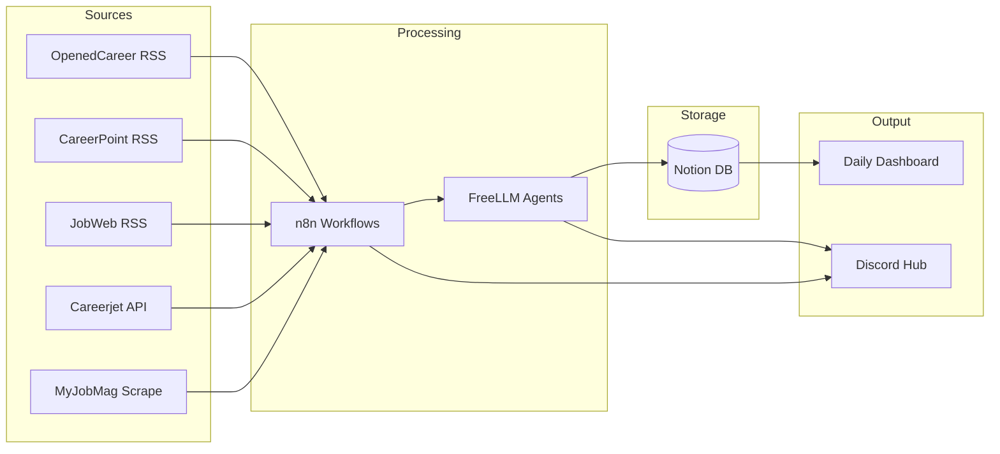

# Job Hunt Ops — Map of Content

> **Discord-first job hunting command center.** n8n automates, FreeLLM agents process, Notion stores, Discord surfaces everything.



## Stack

| Layer | Tool | Role |
|-------|------|------|
| Hub | [[Discord Architecture]] + [[Discord Bot Setup]] | Bot (interactive) + webhooks (automated) |
| Automation | [[n8n Setup & Configuration]] | Workflows, scheduling, webhooks, orchestration |
| Intelligence | FreeLLM (`host.docker.internal:3001`) | Per-task model selection for processing |
| Storage | [[Notion Integration]] | Jobs DB, companies DB, CV, enrichment data |
| Enrichment | [[Data Enrichment Pipeline]] | Two-stage collect → validate pipeline |

## Model Assignment (FreeLLM — 89 models)

| Task | Model | Why |
|------|-------|-----|
| Job feed scanning | `openai/gpt-oss-20b:free` | Fast, cheap, structured extraction |
| Job validation/scoring | `google/gemma-4-31b-it:free` | Reasoning for relevance filtering |
| Cover letter drafts | `mistralai/mistral-large-3-675b-instruct-2512` | Best writing quality |
| Company enrichment | `openai/gpt-oss-120b:free` | Deep research, multi-source |
| Code/scraper logic | `deepseek-ai/deepseek-v4-pro` | Code generation |
| Vision | `mimo-v2-omni` | Screenshots, job images |
| Compression | `gemini-2.5-flash` | Summarization |

## Discord Layout (v2)

```
📋 COMMAND CENTER                          [webhook-driven]
├── #dashboard          — Daily cron summary (8am EAT)
├── #alerts             — Instant high-score matches (score > 90)
├── #logs               — n8n execution health, errors, run stats

🎯 JOBS                                    [webhook + bot]
├── #feed-eee           — Raw EEE job feed (auto-posted)
├── #feed-general       — Adjacent roles (energy, power, automation)
├── #validated          — Agent-scored + vetted (score > 70)
├── #applied            — Application tracking (bot-reactive emoji)
├── #saved              — Bookmarks (bot-reactive)

🔬 RESEARCH                               [webhook-driven]
├── #companies          — Enriched company profiles (WF2)
├── #market-intel       — Salary data, hiring trends

📝 MATERIALS                              [manual / future]
├── #cover-letters      — Agent-drafted CLs, human review
├── #resume-versions    — Tailored resume variants

🤖 AUTOMATION                             [agent infra]
├── #agent-status       — FreeLLM health, model availability
├── #agent-playground   — Workflow testing, prompt tuning
├── #workflow-logs      — Per-workflow detailed output (debugging)

💬 GENERAL
├── #strategy           — Career direction, networking
├── #random             — Off-topic
```

Layout diagram: `discord-layout-v2.excalidraw` in project root.
Architecture diagram: `system-architecture.excalidraw` in project root.

## Workflows

| #   | Workflow                   | Trigger                                   | Status         |                                                 |
| --- | -------------------------- | ----------------------------------------- | -------------- | ----------------------------------------------- |
|     | 1                          | [[wf1-job-feed-scanner]]                  | Cron (4h)      | Building — Tasks 1-5 done, Task 6 (Notion) next |
| 2   | [[wf2-company-enrichment]] | Sub-workflow from WF1 + 12h cron fallback | Ready to build |                                                 |
| 3   | Daily Dashboard            | Cron (8am EAT)                            | Planned        |                                                 |
| 4   | Cover Letter Generator     | React emoji trigger                       | Later          |                                                 |
| 5   | JustHireMe Integration     | Manual/cron                               | Later          |                                                 |

## Notion as Default DB

[[Notion Integration]] replaces flat files as the source of truth:
- **Jobs Database** — all scraped + validated listings
- **Companies Database** — enriched company profiles (relation + rollup)
- **CV page** — current resume (Canva for formatting)
- n8n reads/writes via Notion API (HTTP Request nodes)

## Components

| Component | Doc | Status |
|-----------|-----|--------|
| Scraping | [[n8n Setup & Configuration]] | ✅ Running (Docker + Postgres) |
| Sites | [[Kenyan Job Sites — Feeds & Scraping]] | ✅ Researched (8 sites mapped) |
| Discord | [[Discord Architecture]] + [[Discord Bot Setup]] | 🔲 Awaiting bot token |
| Notion | [[Notion Integration]] | 🔲 Awaiting token refresh |
| Agents | FreeLLM | ✅ Running (89 models) |
| Enrichment | [[Data Enrichment Pipeline]] | ✅ Pattern defined |
| WF1 | [[wf1-job-feed-scanner]] | ✅ Spec complete, ready to build |
| WF2 | [[wf2-company-enrichment]] | ✅ Spec complete, ready to build |

## Decisions

- **2026-05-21:** n8n as scraping layer, not rewriting scraping in JustHireMe
- **2026-05-21:** n8n first (feeds), JustHireMe second
- **2026-05-25:** Discord as central hub (not just output)
- **2026-05-25:** Notion as default DB (not flat files, not Postgres for app data)
- **2026-05-25:** FreeLLM with per-task model routing
- **2026-05-25:** Enrichment pipeline pattern (collect → validate → write)
- **2026-05-25:** Two bots: Zenicious (interactive) + n8n webhooks (automated)
- **2026-05-25:** host.docker.internal for FreeLLM access from Docker
- **2026-05-25:** 48h dedup window (not all-time) to prevent pagination ceiling

## Progress

- [x] n8n self-hosted on Docker (running, Postgres healthy)
- [x] Map KE job site structures (8 sites, priority matrix done)
- [x] FreeLLM proxy running (89 models)
- [x] Workflow 1 spec complete (job feed scanner)
- [x] Workflow 2 spec complete (company enrichment)
- [x] Discord architecture defined (two-bot model)
- [x] Add `extra_hosts` to docker-compose for FreeLLM access
- [x] Refresh Notion API token (currently 401)
- [x] Create Notion databases (Jobs, Companies)
- [ ] Create Discord bot + webhooks (in progress — other session)
- [ ] Build Workflow 1 in n8n (Tasks 1-5 done: RSS, parser, filters, Discord. Task 6 next: Notion write)
- [ ] Build Workflow 2 in n8n
- [ ] Store CV in Notion (Canva for formatting)

## Scaling

- **New job vertical**: add `#feed-{type}` channel
- **New data source**: tag existing feed or new channel if volume > 20/day
- **New workflow**: add channel under AGENTS
- **Team expansion**: role-based permissions per category
